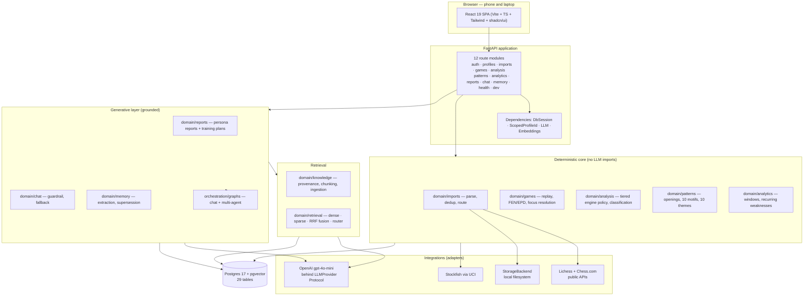
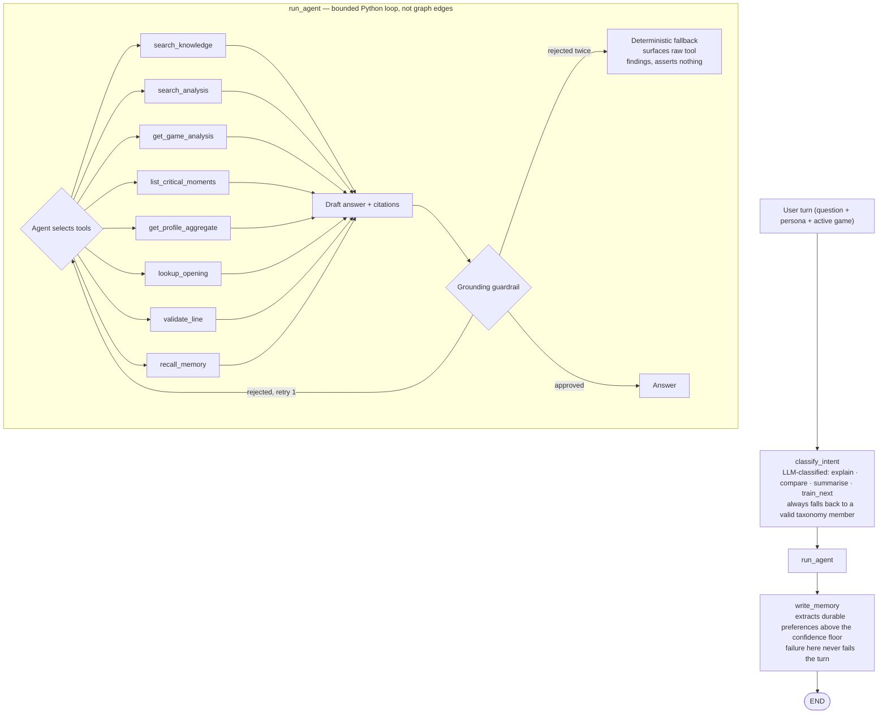
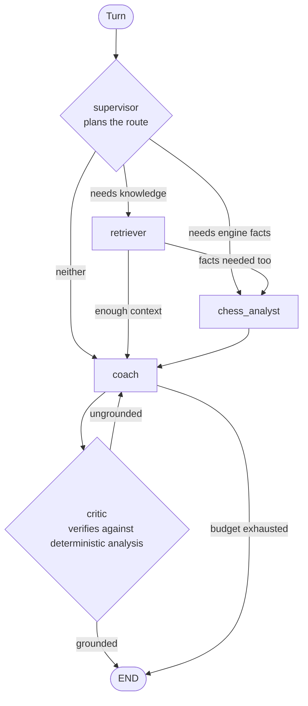
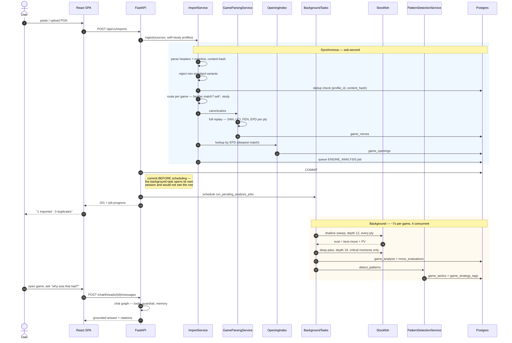
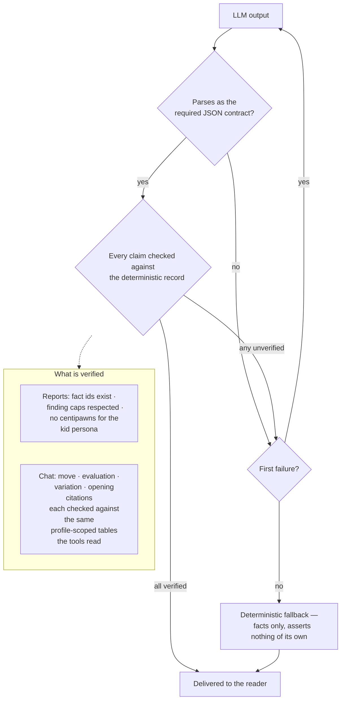
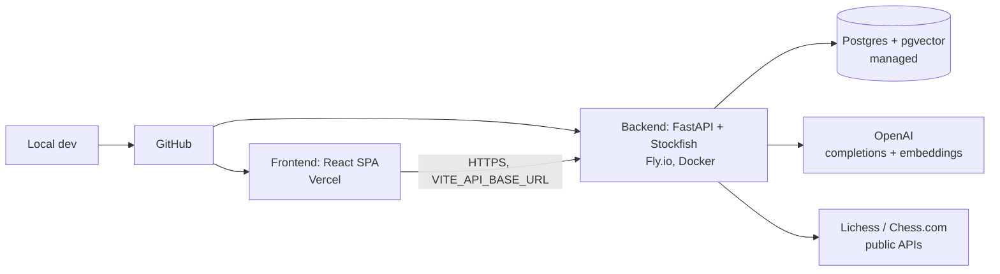

# Architecture — GrandMate v2

Whole-system architecture reference. Pairs with [`Deliverables.md`](Deliverables.md) (the
graded write-up) and [`../project-plan.md`](../project-plan.md) (the phased build).
Diagrams are GitHub-native Mermaid; each also exists standalone under
[`diagrams/`](diagrams/).

**This document describes the system as it is today** — Phases 0–16 of a 19-phase plan.
Anything not yet built is marked as such rather than described in the present tense. The
deep reasoning behind individual choices lives in the 17 ADRs under
[`../final_docs/v2/adr/`](../final_docs/v2/adr/); this document is the map, not the
territory.

---

## 1. Design principles (the invariants)

These are enforced structurally — by tests, by layer checks, by schema constraints — not
by convention. Where a principle has a test that would fail if it were violated, the test
is named.

1. **The LLM never computes chess truth.** Evaluation, best move, principal variation, and
   move classification come from Stockfish; legality comes from python-chess. The language
   model *narrates* facts that were already computed. `tests/test_layer_boundaries.py`
   asserts that `domain/analysis`, `domain/games`, and `domain/patterns` import nothing
   LLM-related and nothing from `orchestration/`.

2. **Deterministic core, generative shell.** Detection and classification are reproducible
   — `ENGINE_THREADS=1` is deliberate, because multi-threaded Stockfish is not
   reproducible across runs. Only explanation prose is generative.

3. **Nothing ungrounded reaches a reader.** Every generated claim is checked against the
   deterministic record before delivery. On failure: one retry, then a deterministic
   fallback. A reader never sees an error and never sees an unverified claim.

4. **Personas change framing, never facts.** The same analysis renders for a self-learner,
   a coach, or a child. `fact_invariance_rate` is a hard-gated metric, measured at 100%.

5. **Three memory layers stay distinct.** Short-term thread state, long-term profile
   memory, and analysis-database truth are three storage models, deliberately not
   collapsed into one (ADR-0005).

6. **Profile isolation is enforced at the interface, once.** `AnalysisRetriever.search`
   requires `profile_id` as a keyword-only argument; the column is `NOT NULL`; no agent
   tool's JSON schema exposes `profile_id` as a parameter, so no model output can request
   another profile's data.

7. **Zero hardcoded secrets or tunables.** Every threshold, depth, ceiling, and model name
   is read from `.env` through a typed `pydantic-settings` module. A magic number in a code
   path is a review failure.

8. **One implementation per capability.** Agent tools, internal services, and any future
   MCP surface share a single implementation. Two code paths with two behaviours is the
   failure mode this rule exists to prevent.

---

## 2. Component architecture

*(Standalone copy in [`diagrams/component-architecture.md`](diagrams/component-architecture.md).)*

The boundary that matters most in that diagram is between **CORE** and **GEN**. It is not
stylistic: a CI step runs `tests/test_layer_boundaries.py` against every module in the
deterministic core, and the build fails if one of them acquires an LLM or orchestration
import.

---

## 3. Component rationale and tradeoffs

| Component | Choice | Why | Tradeoff / alternative |
|---|---|---|---|
| Orchestration | LangGraph | Stateful graph plus a Postgres checkpointer gives durable thread state for free | A plain sequential orchestrator — simpler, but conversation persistence becomes ours to build |
| LLM | `gpt-4o-mini` behind an `LLMProvider` Protocol | Cheap enough for per-turn use; the Protocol means swapping vendors is one adapter (ADR-0006) | No failover today — a single provider outage stops generation. The sibling project's LiteLLM gateway solves this; noted as a real gap |
| Engine | Stockfish via UCI, async adapter | Free, local, deterministic at `ENGINE_THREADS=1`, no per-call cost | Depth 12 sweep is a cost/latency compromise; the deep pass at 18 covers critical moments only |
| Database | Postgres 17 + pgvector, one container | One engine for relational data *and* vectors — no second datastore to operate | Supabase deferred (ADR-0015); adopting it later is a connection-string change |
| Vector search | pgvector, in the same database | The `analysis` bucket is profile-scoped and joins against application tables; a separate vector store would put a network hop inside an authorization boundary | A dedicated vector DB would scale further than this corpus needs |
| Sparse retrieval | `rank-bm25`, in-memory | Simplest fully-testable option at this corpus size | Postgres full-text search would avoid loading the corpus into memory |
| Migrations | Alembic, URL injected from settings | Credentials stay in `.env`, one source of truth | Two drivers in play: asyncpg for the app, psycopg for Alembic |
| Frontend | React 19 + Vite + TS + Tailwind v4 + shadcn/ui | Typed contracts end to end; feature-driven structure | Next.js if SSR ever matters — it does not for an authenticated SPA |
| Observability | Custom in-process tracing (ADR-0013) | Zero LLM cost, zero added latency, no data egress | Dev-only by design, so production is currently unobserved. LangSmith adopted for that in Phase 17 (ADR-0017) |
| Evaluation | RAGAS plus purpose-built harnesses | 8 recorded suites, versioned runs, thresholds in config | Golden sets are self-authored and not yet human-reviewed |

---

## 4. Agent workflow (control flow)

Two graphs exist. The **chat graph** serves production traffic. The **multi-agent
supervisor graph** is built, tested, and evaluated head-to-head against it, but is
deliberately not wired to any route pending the evidence-based decision Phase 13 was
scoped to make.

### 4.1 Chat graph — the production path

*(Standalone copy in [`diagrams/agent-workflow.md`](diagrams/agent-workflow.md).)*

Two design choices in that diagram are worth stating explicitly, because they look like
omissions otherwise.

**The tool loop is Python, not graph edges.** Modelling each tool call as its own node
would put intra-turn scratch work into checkpointed state. Instead the loop runs inside
one node and only the user/assistant exchange is persisted — so a long conversation's
stored size grows with turn count, not tool-call count. LangGraph's real job here is the
checkpointer, not diagramming the scratch work.

**`write_memory` is its own node.** Extraction can never change what the user was already
told, and a failure there must not fail the turn. Two responsibilities that must never
entangle get two places to change independently.

### 4.2 Multi-agent supervisor graph — built, evaluated, not routed

*(Standalone copy in [`diagrams/multi-agent-graph.md`](diagrams/multi-agent-graph.md).)*

Every node checks a shared step/tool/token budget before doing work and records
`skipped="budget_exhausted"` rather than silently overrunning. `MULTI_AGENT_*` ceilings are
separate from and larger than the single-agent ones, because this budget is spent across
up to five agents in one turn.

---

## 5. Request lifecycle — PGN to coaching answer

The single most useful thing to understand about this system is what one `POST /imports`
actually triggers, because it spans a synchronous request, a background job, and a later
interactive turn.

*(Standalone copy in [`diagrams/request-lifecycle.md`](diagrams/request-lifecycle.md).)*

**Variant rejection is a boundary, not a scope decision.** Antichess, Atomic, Crazyhouse,
Horde, King of the Hill, Three-check and Racing Kings parse and canonicalize without
complaint, and then **segfault Stockfish** when the analysis job feeds it their positions —
an Antichess game legally captures both kings, and standard Stockfish crashes on a kingless
FEN rather than returning an error. The crash surfaced far downstream as a dead analysis
job, so the gate sits at `parse_pgn_text`, the single point every source passes through.
Variant resolution is delegated to python-chess's `uci_variant` rather than a hardcoded
name list, so a variant never seen before is still classified correctly, and the check runs
*before* `game.errors` so a variant game is not reported as `malformed`.

The commit-before-scheduling step is annotated because it is a real defect that shipped and
was fixed. The background task opens a *separate* session; scheduling it before the
request's own transaction committed meant `session.get(Job, job_id)` returned `None` under
normal read-committed isolation, a defensive guard treated that as a no-op, and every job
stayed `pending` forever with no error logged. Found by manual testing, not by the suite —
the automated tests called the dispatcher directly and never exercised the real HTTP path.

---

## 6. Data model and contracts

29 tables. The clusters, and what owns each:

| Cluster | Tables | Owner |
|---|---|---|
| Identity | `users`, `user_identities`, `profiles`, `profile_sources`, `profile_relationships`, `audit_events` | `domain/auth`, `domain/profiles` |
| Ingestion | `jobs`, `games`, `game_moves` | `domain/imports`, `domain/games` |
| Analysis | `game_analysis`, `move_evaluations` | `domain/analysis` |
| Patterns | `game_openings`, `game_tactics`, `game_strategy_tags` | `domain/patterns` |
| Aggregation | `profile_aggregate_snapshots` | `domain/analytics` |
| Knowledge | `knowledge_documents`, `knowledge_chunks`, `analysis_knowledge_chunks` | `domain/knowledge` |
| Generation | `game_reports`, `training_recommendations`, `llm_usage_daily` | `domain/reports`, `domain/llm_usage` |
| Memory | `chat_threads`, `long_term_memory` | `domain/chat`, `domain/memory` |
| Library-owned | `checkpoints`, `checkpoint_blobs`, `checkpoint_writes`, `checkpoint_migrations`, `store`, `store_migrations` | LangGraph |

**Versioning, not overwriting.** `game_analysis`, `profile_aggregate_snapshots`,
`game_reports`, and `training_recommendations` all add a new row per computation rather than
updating in place. A re-analysis adds a run; it does not destroy the previous one.
`long_term_memory` follows the same instinct differently — a superseded entry keeps its row
with `superseded_at` set, because the point of superseding rather than overwriting is that
a wrong memory stays traceable.

**Library-owned tables are deliberately outside Alembic.** LangGraph's checkpointer and
store create and version their own DDL via `.setup()`. `alembic/env.py` carries an
`include_object` filter matching `checkpoint*`/`store*` prefixes, so autogenerate cannot
propose dropping them — a real failure the first Phase 11 migration attempt produced.

---

## 7. Memory design — three layers, deliberately not one

ADR-0005's model, as built:

| Layer | Storage | Lifetime | Read by |
|---|---|---|---|
| **Short-term thread state** | LangGraph Postgres checkpointer | Per thread, survives restart | The graph, automatically |
| **Long-term profile memory** | `long_term_memory` (audited) + LangGraph store (agent-readable) | Until superseded or deleted; no automatic expiry | The `recall_memory` tool |
| **Analysis truth** | The relational tables above | Permanent, versioned | Deterministic services and agent tools |

The long-term layer pays a **dual write** — the audited table the UI lists and deletes
from, and the store the agent actually reads during a conversation. That cost is paid once
inside `MemoryService.write_candidate_memories` rather than left for every caller to keep in
sync.

Writes are **silent and confidence-gated**, not confirmation-prompted.
`MEMORY_WRITE_CONFIDENCE_FLOOR` (default 0.7) is the entire enforcement mechanism for "only
durable facts persist." Extraction reads only what the *user* said — an evaluation scenario
deliberately checks that the assistant replying "I will remember that" while the user only
says "ok" writes nothing.

---

## 8. RAG subsystem

Five buckets. Four are static and curated; the fifth is per-profile and generated.

| Bucket | Source | Chunking | Scope |
|---|---|---|---|
| `rules` | FIDE Laws of Chess (vendored PDF) + authored engine-semantics notes | Token window (`CHUNK_SIZE_TOKENS`/overlap) — PDF-extracted text has no headings left to exploit | Global |
| `openings` | Authored opening-family notes | One `##` heading section per chunk | Global |
| `tactics` | Authored tactical-motif notes | One `##` heading per chunk — one motif per chunk | Global |
| `strategy` | Authored strategic-principle notes | One `##` heading per chunk | Global |
| `analysis` | Projected from a profile's own analysed games | One finding per chunk | **Profile-scoped** |

Two chunkers, not a token knob per bucket. Every authored document is already written at
the granularity the bucket calls for, so heading boundaries *are* the correct chunk
boundaries; a per-bucket token target would not improve on that. `chunk_by_tokens` exists
for the one genuinely unstructured input.

**Retrieval is three strategies plus a router.** Dense (pgvector), sparse (BM25), and
hybrid (reciprocal rank fusion) are all implemented and all exercised through the same
production entry point. `select_buckets` heuristically routes a query. The agent chooses
per query — retrieval is exposed as *tools*, not run as a fixed retrieve-then-generate
prefix, which is the distinction that makes this agentic RAG rather than a chain.

**Profile isolation is the load-bearing property.** `analysis` chunks carry a `NOT NULL`
`profile_id`; `AnalysisRetriever.search` takes it keyword-only; and the dev-only
`GET /dev/search` route deliberately excludes the `analysis` bucket entirely rather than
build a second, weaker isolation path.

---

## 9. Grounding — how an ungrounded claim is stopped

Two independent guardrails, one per generative surface.

*(Standalone copy in [`diagrams/grounding-guardrail.md`](diagrams/grounding-guardrail.md).)*

The reader is never shown an error and never shown an unverified claim. Which of the two
paths produced the text is surfaced honestly — the API returns a `source` field and the UI
carries a badge.

This is measured, not asserted: `grounded_rate` is **100%** on a real run against a real
model, and it is 100% *by construction* — the retry-then-fallback loop makes any other
value impossible. Observed live: on one real game the kid persona failed grounding twice
and fell back to the deterministic summary while self-learner and coach succeeded.

---

## 10. Observability

**Today**: ADR-0013's in-process tracing. A `contextvars`-bound recorder collects spans;
recording one is a `perf_counter()` read and a list append. Responses carry only an
`X-Trace-Id` header and the panel fetches the full trace on demand — deliberately *not*
the sibling project's approach of embedding the payload inline in every response.

Span kinds emitted today: `HTTP`, `ENGINE`, `LLM`, `GRAPH_NODE`, `AGENT`, `GROUNDING`.
Three more are declared and not yet produced (`DB`, `RETRIEVAL`, `JOB`).

**Hard-gated off in production** — routes not mounted, middleware not installed, sensitive
capture forced `False` regardless of configuration, because prompt text can contain a
user's game history.

**Consequence, stated plainly**: a hosted deployment today runs the agent completely
unobserved. Phase 17 closes this with LangSmith (ADR-0017), with redaction reusing the
existing sanitiser and tracing defaulting to off.

---

## 11. Deployment topology — planned, not yet built

*(Standalone copy in [`diagrams/deployment-topology.md`](diagrams/deployment-topology.md).)*

**Nothing above has been deployed.** The hosting decision is Phase 17's, deferred from
Phase 0 (D-006). [`DEPLOYMENT.md`](DEPLOYMENT.md) documents the target and the four
blockers that must be fixed first — all four are real, found by reading the code, and none
has been worked around.

---

## 12. Non-functional concerns

| Area | Position today |
|---|---|
| **Reproducibility** | Verified: independent engine instances at the same depth agree exactly. Documented caveat — re-querying one *warm* engine does not, because the hash table carries state |
| **Cost control** | `LLM_DAILY_TOKEN_CEILING` enforced atomically via a Postgres upsert, not read-then-write. Agent step, tool-call, and token ceilings are hard limits |
| **Isolation** | Enforced at the retriever interface and in the tool schemas, tested adversarially |
| **Configuration** | Every tunable in `.env` through typed settings; a test asserts secrets never appear in reprs |
| **Testing** | 785 backend tests, 72 frontend, all passing; `mypy --strict` clean; layer-boundary check as its own CI step |
| **Auth** | ⚠️ **Known gap.** Username-claim login proves an account exists, not that the user owns it (ADR-0014). `ProfileSource.verified` is `False` on every row. Acceptable only while the system holds nothing private; must close before any private-data feature |
| **Scaling** | Background jobs run in-process via `BackgroundTasks`. Fine at MVP scale; a real worker reading the existing `jobs` table is the next step, and the table was designed for it from Phase 3 |
| **Failover** | ⚠️ **Known gap.** One LLM provider, no fallback. A provider outage stops all generation |

---

## 13. Where the reasoning lives

This document says *what* the system is. For *why*:

| Question | Document |
|---|---|
| What is being built, for whom | [`../final_docs/v2/prd.md`](../final_docs/v2/prd.md) |
| Every architectural decision, with alternatives | [`../final_docs/v2/adr/`](../final_docs/v2/adr/) — 17 ADRs |
| Every product decision, locked or open | [`../final_docs/v2/decisions-log.md`](../final_docs/v2/decisions-log.md) |
| Retrieval and grounding design in depth | [`../final_docs/v2/rag-architecture.md`](../final_docs/v2/rag-architecture.md) |
| Tables, columns, relationships | [`../final_docs/v2/data-model.md`](../final_docs/v2/data-model.md) |
| What works today, with runnable steps | [`../final_docs/v2/features-and-use-cases.md`](../final_docs/v2/features-and-use-cases.md) |
| Phase-by-phase delivery record | [`../final_docs/v2/phase-reports/`](../final_docs/v2/phase-reports/) |
| Evaluation results | [`evaluation_report.md`](evaluation_report.md) |
