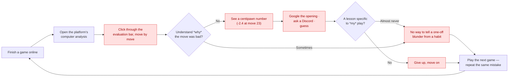
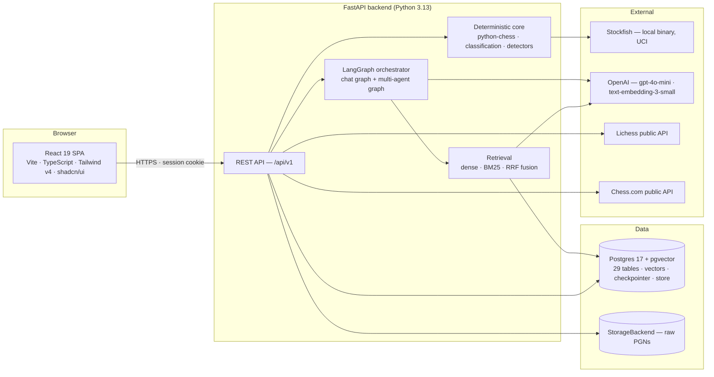
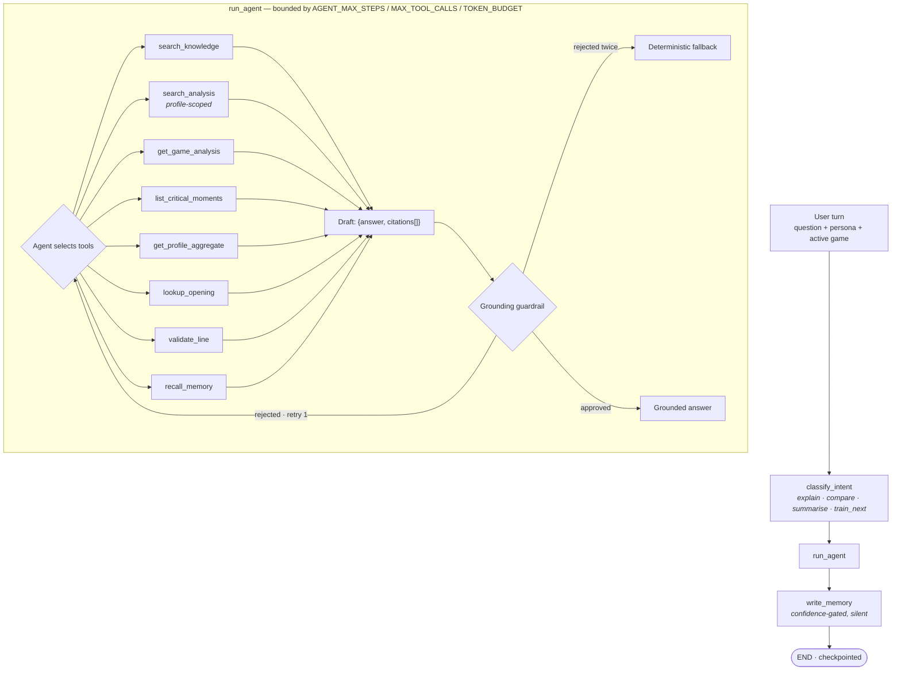

# GrandMate v2 — Certification Challenge Deliverables

The complete set of deliverables for the AI Makerspace Certification Challenge. Structured
to the rubric's seven tasks; the per-criterion self-assessment lives in
[`grading-rubric.md`](grading-rubric.md).

**Deployed and running**: frontend at https://grandmate.vercel.app, backend at
https://grandmate-v2-backend.fly.dev. Task 4 asks for a deployed, decoupled prototype and
that criterion is now met — see §4.2 for the evidence, and `DEPLOYMENT.md` §0 for the seven
problems in the way, three of which were only findable by deploying.

## Table of contents

1. [Problem definition and target audience](#1-problem-definition-and-target-audience)
2. [Proposed solution and architecture](#2-proposed-solution-and-architecture)
3. [Dealing with the data](#3-dealing-with-the-data)
4. [End-to-end prototype and deployment](#4-end-to-end-prototype-and-deployment)
5. [Evaluation framework and results](#5-evaluation-framework-and-results)
6. [Advanced retrieval and iterative improvements](#6-advanced-retrieval-and-iterative-improvements)
7. [Future reflections](#7-future-reflections)
8. [Next steps](#8-next-steps)

---

## 1. Problem definition and target audience

### 1.1 Problem statement

> Chess engines tell a player *what* went wrong in one game, but nothing tells them **which
> of their mistakes are habits** — so players receive a verdict on a single game instead of
> a diagnosis of how they actually play.

### 1.2 Why this is a problem for this user

The primary user is the **self-directed club player**, roughly 800–1800 rated on Lichess or
Chess.com, who plays regularly and wants to improve. They finish a game, run the engine,
and see `-2.4` at move 23 — and learn almost nothing they can act on. The limitation is
structural, not a quality problem: engine output is per-move and per-game *by
construction*. It can state that a move lost material. It cannot state "this is the fourth
time this month you have castled into a weakened king position," or "you score 68% with
White in the Ruy Lopez and 31% with Black in the French." Playing platforms optimise for
the game just played; nobody optimises for the pattern across the last sixty. The player is
left performing the hardest part of coaching — pattern recognition across their own history
— by memory and intuition, which is exactly what they are least equipped to do about their
own blind spots.

A human coach breaks this loop, but at $30–100/hour reviewing perhaps one game per session,
which scales to neither thirty games nor a coach's dozen students. And the two other people
who need this information are served worse still. A **coach** preparing for a lesson needs
per-student synthesis across many games and currently does it by hand, per student. A
**junior player** needs feedback they can read: centipawn losses and engine notation are
not feedback for an eleven-year-old, they are noise. Today all three audiences receive the
same undifferentiated engine output — and when a tool does try to explain in natural
language, a general LLM will confidently invent a variation that was never played, which is
worse than no explanation, because a learner cannot tell the difference.

| User | Wants | Persona served |
|---|---|---|
| Club player, self-directed | To know which mistakes are habits, and what to drill | `self_learner` |
| Coach with several students | Fast per-student preparation before a lesson | `coach` |
| Junior player (8–14) | Feedback they can actually read and act on | `kid` |
| Parent of a junior | Whether the child is genuinely improving | deferred, post-MVP |
| Tournament preparer | An opponent's tendencies | deferred, post-MVP |

The persona layer is built so the last two are additions rather than rewrites.

### 1.3 Current-state workflow and bottlenecks

*(Standalone copy with commentary: [`diagrams/user-workflow-pain-points.md`](diagrams/user-workflow-pain-points.md).)*

The red nodes are where the loop fails to produce a lesson. Nothing in it retains anything,
so the next game starts from zero.

### 1.4 Evaluation dataset

Eight versioned datasets across eight evaluation suites, each traceable to a concrete
scenario file, seeded position, or test — never to asserted narrative. Full design in
[`evaluation_data_design.md`](evaluation_data_design.md); measured results in
[`evaluation_report.md`](evaluation_report.md).

Representative scenarios spanning the product's real claims:

| # | Scenario | What it must prove | Ground truth from |
|---|---|---|---|
| 1 | A move classified `blunder` by the production classifier | Detection agrees with an independent engine | Stockfish at **depth 24**, against a production classifier running depth 12 |
| 2 | "What was my opening in this game?" | The agent retrieves and cites a real `OpeningMatch` | `game_openings`, seeded |
| 3 | "What do I keep getting wrong?" | Routes to profile aggregate, not a single game | `profile_aggregate_snapshots` |
| 4 | Same game rendered for all three personas | The **fact set is identical** across renderings | The scenario's own fact list |
| 5 | Kid persona on a complex game | No centipawn values; ≤3 findings; low-confidence suppressed | `REPORT_KID_*` settings |
| 6 | An answer citing a move that was never played | The guardrail rejects it before delivery | `game_moves`, seeded |
| 7 | "I prefer short answers" stated in chat | Written to long-term memory above the confidence floor | The scenario's expected kind |
| 8 | Assistant says "I'll remember that", user replies only "ok" | **Nothing** is written — the durable statement was not the user's | Adversarial negative case |
| 9 | Out-of-corpus query (Go, football) | Bounds how much junk retrieval will confidently return | Known-negative by construction |

---

## 2. Proposed solution and architecture

### 2.1 Solution in one sentence

> A companion layer over the platforms people already play on: it ingests games, computes
> deterministic engine-backed analysis, detects patterns recurring across many games, and
> explains them differently depending on who is reading — with every generated claim
> verified against the deterministic record before anyone sees it.

The name is a play on **Grand**master and check**mate**, with "mate" in its colloquial
sense — a companion rather than a cold analysis tool.

### 2.2 System infrastructure and stack justification

*(Standalone copy: [`diagrams/system-infrastructure.md`](diagrams/system-infrastructure.md).)*

| Choice | One-sentence justification |
|---|---|
| **React 19 + Vite + TypeScript** | Typed contracts from API schema to component props, with a build fast enough to keep the dev loop tight. |
| **Tailwind v4 + shadcn/ui** | Shared primitives that theme light and dark from one token set, rather than a component library to fight. |
| **FastAPI** | Async throughout — required, since Stockfish and OpenAI calls are both I/O-bound — with Pydantic validation on every boundary. |
| **LangGraph** | A state graph plus a Postgres checkpointer gives durable multi-turn conversation without building persistence ourselves. |
| **python-chess** | The reference implementation for PGN parsing, legality, and FEN/EPD generation; reimplementing it would be inventing bugs. |
| **Stockfish, local, single-threaded** | Free, deterministic, no per-call cost — and it is the ground truth every other layer depends on. |
| **Postgres 17 + pgvector** | One engine for relational data *and* vectors, so profile-scoped retrieval joins application tables inside the same authorization boundary. |
| **OpenAI `gpt-4o-mini`** | Cheap enough to run per chat turn, behind an `LLMProvider` Protocol so the vendor is one adapter from replaceable. |
| **Lichess / Chess.com public APIs** | Account existence at login and public game archives at import, with no OAuth approval gate on either path. |

### 2.3 Agent workflow, end to end

*(Standalone copy: [`diagrams/agent-workflow.md`](diagrams/agent-workflow.md). Full
architecture: [`ARCHITECTURE.md`](ARCHITECTURE.md).)*

**This is agentic RAG, not a retrieve-then-generate chain.** Retrieval is exposed to the
agent *as tools*, so it chooses strategy per query. Eight tools, none of which accepts
`profile_id` — one `ToolContext` binds it for the whole turn, so no model output can
request another profile's data.

---

## 3. Dealing with the data

### 3.1 Data sources and external APIs

| Source | Type | Purpose | Licence / provenance |
|---|---|---|---|
| **User PGN** — paste, file, batch upload | User-supplied | Primary ingestion path; one endpoint handles all three | User's own |
| **Lichess API** — `/api/user/{u}`, game export | External REST | Account existence at login; public game archives at import | Public, unauthenticated |
| **Chess.com API** — `/pub/player/{u}`, monthly archives | External REST | Same two purposes | Public, unauthenticated |
| **`lichess-org/chess-openings`** | Vendored dataset | ~3,800 EPD-keyed opening entries for ECO identification | **CC0 1.0** — commit pinned, `PROVENANCE.md` records source, commit, retrieval date, reviewer |
| **FIDE Laws of Chess** | Vendored PDF | The `rules` corpus bucket | **Licence unclear** — recorded honestly as unresolved rather than invented, per an explicit owner decision |
| **Authored corpus** — tactics, openings, strategy, engine semantics | Original prose | The other three buckets | Original; cross-checked against reference material, no text reproduced |
| **Stockfish** | Local binary | All evaluation ground truth | GPL, run as a subprocess |
| **OpenAI** | External API | `gpt-4o-mini` completions, `text-embedding-3-small` embeddings | Commercial |

**Provenance is enforced, not documented.** `domain/knowledge/provenance.py` parses a
required header (`Title` / `Source` / `Source-URL` / `Licence` / `Retrieved`) from every
corpus document and **rejects** any document missing a field. A document without provenance
cannot enter a bucket.

### 3.2 Chunking strategy and rationale

Five buckets. Two chunkers — deliberately not a token-size knob per bucket.

| Bucket | Source | Chunk unit | Rationale |
|---|---|---|---|
| `rules` | FIDE PDF | Token window (`CHUNK_SIZE_TOKENS=512`, overlap 64) | PDF-extracted text has no heading structure left to exploit; overlap keeps an article and its clauses together across a boundary |
| `rules` | Authored engine-semantics notes | One `##` section | Written one topic per heading |
| `openings` | Authored family notes | One `##` section | One opening family per chunk — a split family loses the ECO range it is defined by |
| `tactics` | Authored motif notes | One `##` section | Motifs are atomic; half a fork explanation retrieves as noise |
| `strategy` | Authored principle notes | One `##` section | One theme per chunk |
| `analysis` | Projected from a profile's own analysed games | One finding per chunk | A finding is the unit a coach reasons about; **profile-scoped**, `NOT NULL profile_id` |

**Why two chunkers rather than per-bucket token targets.** Every authored document is
already written at the granularity its bucket calls for, so heading boundaries *are* the
correct chunk boundaries — a configured token target would cut across them and could not
improve on them. `chunk_by_tokens` exists for the one genuinely unstructured input.
`chunk_markdown_by_heading` **raises** if a document has no `##` headings, so a
badly-formatted document fails ingestion instead of silently producing one enormous chunk.

---

## 4. End-to-end prototype and deployment

### 4.1 What is built

A decoupled full-stack application: FastAPI backend, React SPA frontend, no shared
dependency graph, path-scoped CI per side.

**Backend** — 12 route modules, 15 domain modules, 29 database tables, reversible Alembic
migrations with up→down→up tested per phase. Deterministic core (ingestion, canonical game
objects, tiered Stockfish analysis, 10 tactical motifs, 10 strategic themes, multi-game
aggregation) kept structurally separate from the generative layer by a CI-enforced
layer-boundary check.

**Frontend** — 14 features: `auth`, `imports`, `games`, `analytics`, `reports`, `chat`,
`memory`, `training`, `profiles`, `devinsight`, `health`, `learning`, `game-feedback`,
`workspace`.

Three routes only — `/` , `/login`, and a catch-all. Import, Games, Dashboard, Chat, Memory
and Game-Detail were six separate pages until Phase 16a (D-035); they are now panels and
tabs inside one three-panel workspace shell, so the surface is a single application screen
rather than a set of destinations. The engine-detail tabs ("Moves", "Patterns") are opt-in
behind a persisted switch: they show the raw deterministic output, and a reader who came to
understand one game should not have to walk past it first.

**Verified running locally, end to end**, against real Postgres, a real Stockfish binary,
and real `gpt-4o-mini` calls — not mocks. The full demo path: log in → paste a PGN → watch
background analysis complete → read per-move classifications, opening, motifs and themes →
open the dashboard for recurring weaknesses → switch personas → ask a question in chat and
get a cited answer → state a preference and see it persist to the memory audit page.
Runnable steps for every capability:
[`../final_docs/v2/features-and-use-cases.md`](../final_docs/v2/features-and-use-cases.md).

> `final_docs/` is a git submodule pointing at a **private** repository
> (`rakeshnetdev/grandmate_final_docs`). Every `../final_docs/...` link in this document
> needs `git submodule update --init` in a local checkout, and does not resolve on
> github.com without access to that repository.

### 4.2 Deployment — met

| | |
|---|---|
| Frontend | https://grandmate.vercel.app (Vercel) |
| Backend | https://grandmate-v2-backend.fly.dev (Fly.io, `sjc`) |
| Database | Neon Postgres 17 + pgvector 0.8.0, AWS `us-west-2` |

Decoupled as the rubric asks: two hosting providers, two toolchains, no shared dependency
graph, talking over a typed HTTP contract.

Verified against the live stack rather than asserted — `/ready` returns
`missing_configuration: []` with `stockfish_binary: true`, the corpus holds 92 chunks
across four buckets, the SPA rewrite serves deep links, CORS preflight returns the exact
origin with credentials allowed, and the full path (login → import → analysis → chat) was
walked in a browser. The evidence table is [`DEPLOYMENT.md`](DEPLOYMENT.md) §9.

**The more useful part of that document is §0.** Seven problems stood between a working
local application and a working deployed one. Four were predicted by reading the code
before any deploy was attempted. Three were not:

- **Stockfish was never at the configured path.** Debian installs it to
  `/usr/games/stockfish`; the default is `/usr/local/bin/stockfish`. The container reported
  perfectly healthy and analysed nothing, because only the background worker touches the
  engine and its failure is on no request path.
- **`scripts/` was not in the image**, so the corpus-ingestion command this very document
  told the operator to run failed with `ModuleNotFoundError`. That could not have been
  caught by reading code: the thing that broke is a command a human runs by hand.
- **A fix for one problem deadlocked the deployment.** Treating a placeholder CORS origin
  as required configuration made the backend refuse to start until it knew the frontend's
  origin — while the frontend could not be built until it knew the backend's URL, since
  `VITE_API_BASE_URL` is compiled into the bundle. Ten restart attempts on an otherwise
  healthy container. The repair splits "cannot function" from "not yet wired to its
  frontend", so placeholders warn instead of being fatal.

This document previously said `DEPLOYMENT.md` was "marked PLANNED — NOT YET VERIFIED
throughout, and its Verified table deliberately left empty rather than filled in from
intent." That restraint turned out to be worth something: three of the seven problems were
findable *only* by deploying, which is precisely what an intent-filled table would have
claimed was already fine.

**What is still not verified**: load of any kind, recovery from a mid-analysis restart
(`min_machines_running = 1` is a workaround for the absent worker, not a replacement),
Vercel preview origins, and cost over a full billing period.

---

## 5. Evaluation framework and results

### 5.1 The rule that makes these numbers falsifiable

**Ground truth never comes from the code being graded.** A retrieval query whose correct
chunk was chosen by the retriever, or a move label produced by the classifier being scored,
measures self-consistency and reports it as accuracy — silently, and with excellent
numbers. Two corollaries, both enforced in the harnesses: a metric that could not be
measured is reported as *not measured* rather than defaulted to a pass, and a synthetic set
is never read as though it were the golden set.

### 5.2 The harness

Three layers, deliberately distinguished because conflating them is how an evaluation
section becomes a rubber stamp:

1. **Deterministic** — free, exactly reproducible. Classifier accuracy against an
   independent depth-24 oracle; retrieval hit rate and MRR against queries with a
   known-by-construction correct chunk.
2. **Judged** — real cost, run-to-run variance. RAGAS faithfulness, response relevancy,
   LLM-judged tone fidelity.
3. **Structural** — not sampled at all. `grounded_rate`, `intent_valid_rate`,
   `staleness_resolved`, `cross_profile_isolated` are properties the code *guarantees* and
   that are verified against real Postgres.

Eight suites, each with a versioned dataset and a timestamped run record.
[`evaluation_report.md`](evaluation_report.md) is **generated** from those records by
`backend/evals/report.py` — no figure in it is hand-written, so it cannot drift from the
runs it describes.

### 5.3 Results and conclusions

Full tables in [`evaluation_report.md`](evaluation_report.md). The conclusions that matter:

**The deterministic core is sound, and the test proving it can fail.** Detection F1
**1.000**, severity accuracy **0.750** against an independent depth-24 oracle (n=24). The
negative control — the same harness against deliberately corrupted thresholds — collapses
to F1 **0.500** and severity **0.125**. A test that cannot fail proves nothing, so the
collapse matters more than the passing score. Per-class breakdown shows accuracy is not
uniform: `inaccuracy` is weakest (F1 0.571), which is the expected place for a classifier
to disagree with an oracle.

**Grounding is structurally guaranteed and measured at 100%.** `grounded_rate` and
`intent_valid_rate` are both 100% — by construction, not by sampling. Observed live: on one
real game the kid persona failed grounding twice and fell back to the deterministic
summary, while self-learner and coach succeeded, in the same session.

**Retrieval is strong, and hybrid does not win outright.** Context precision 0.936 /
recall 0.977 / MRR 0.949 for hybrid — but *sparse alone* matches or exceeds it on
precision and recall at this corpus size. Recorded as the honest outcome rather than
smoothed over. Hybrid does have the best MRR, which asks a narrower question.

**⚠️ A hard-gated metric is currently failing.** `fact_invariance_rate` is **94.4%** on the
most recent 30-scenario persona run. That metric is zero-tolerance — the product's central
claim is that personas never change chess truth — and an earlier 5-scenario run scored
100%. The expanded set found a real violation. This is an open item, not a passing result,
and is recorded as such in [`grading-rubric.md`](grading-rubric.md).

**Multi-agent orchestration was evaluated and not adopted.** Single-agent faithfulness
0.600 vs multi-agent 0.504; relevancy 0.406 vs 0.118. Against a pre-declared exit criterion
("multi-agent must match or beat single-agent on both to be adopted"), it did not. The
supervisor graph stays built, tested, and unrouted. The run is flagged `directional_only` —
12 scenarios cannot quantify the gap, only show it did not clear the bar.

**Faithfulness is below target and understood.** 0.701 against a 0.85 target. Manually
reading all answers found no fabricated game-specific claim; RAGAS scores every sentence
including legitimate uncited coaching advice. Either the threshold needs recalibrating for
a system that intentionally gives advice, or the output contract needs an explicit
advice-versus-fact split.

**Limitations, stated rather than found by a reviewer.** Every golden set is self-authored
with `reviewed_by` null, so judged scores are informative rather than gating. Sample sizes
are small (24 classifier positions, 12 trajectory scenarios). Retrieval "semantic" queries
retain vocabulary overlap with their source chunks, which structurally favours BM25 and is
the likely reason hybrid does not win. Everything is scored against one model.

---

## 6. Advanced retrieval and iterative improvements

### 6.1 Advanced retrieval: hybrid RRF over a bucket-routed multi-corpus index

**The problem.** Dense vector search generalises away exact terms — an ECO code like `C89`,
a coordinate like `e4`, an opening name like "Marshall Attack" — and returns diluted
results. Sparse search catches those but misses conceptual paraphrase.

**The implementation.** Dense (pgvector) and sparse (BM25) retrieval fused by **reciprocal
rank fusion**, over a corpus partitioned into five buckets with a heuristic router
(`select_buckets`) selecting which to search. The bucket filter applies before fusion, so
rules language cannot bleed into strategy advice. All three strategies run through the same
production entry point, so the benchmark measures what the application actually does.

The fifth bucket, `analysis`, is **profile-scoped**: a player's own games become retrievable
knowledge, isolated at the retriever interface with `profile_id` as a keyword-only argument
and a `NOT NULL` column behind it.

### 6.2 Retrieval comparison — baseline vs advanced

Measured over 41 corpus-derived queries (17 lexical, 19 semantic, 5 negative) against a
92-chunk index, scored by RAGAS non-LLM context precision and recall.

| Retriever | Context precision | Context recall | MRR | Negative FP rate |
|---|---|---|---|---|
| Dense (baseline) | 0.907 | 0.951 | 0.914 | 100% |
| Sparse (BM25) | **0.927** | **0.983** | 0.921 | 100% |
| **Hybrid RRF (advanced)** | **0.936** | 0.977 | **0.949** | 100% |

**Honest reading**: hybrid has the best context precision and the best MRR, but sparse
edges it on recall — so hybrid does **not** beat both baselines on both metrics, and
`rag-architecture.md`'s own rule ("if hybrid does not beat both baselines, the simpler
retriever ships") applies. Hybrid remains fully implemented and available, since the agent
chooses strategy per query anyway. Recorded rather than presented as a clean win.

**A known gap, measured**: with `RETRIEVAL_MIN_SCORE=0.0` every retriever returns its
`top_k` regardless of relevance, so all five out-of-corpus queries produce a false positive
at every strategy. That is a measured consequence of a configuration default, not a
retrieval defect — but it means the negatives currently measure the absence of a threshold.

### 6.3 Second improvement: detector precision, driven by external ground truth

The tactical motif detectors were first validated only against hand-built positions — which
is the detector grading its own homework. The improvement was to score them against **real,
independently tagged Lichess puzzles** (CC0), where the ground truth is Lichess's own
community-vetted theme tag.

**That immediately found a real bug.** Both `skewer` puzzles failed. `skewer.py` required
the front piece's trade value to exceed the back piece's, but `PIECE_VALUES_CP[KING] == 0`
by design — so the textbook case where a *king* is checked and forced to move, exposing a
valuable piece behind it, could never satisfy the comparison. Fixed, with a regression test
built from one of the two puzzles that caught it.

| | Before | After |
|---|---|---|
| Recall on tagged puzzles | 18 / 20 | **20 / 20** |
| False positives on near-miss fixtures | 0 / 10 | **0 / 10** |

A second, negative-result iteration is worth naming because it was also driven by
evaluation: the **multi-agent supervisor graph** was built, scored head-to-head against the
single agent, and **not adopted** because it lost on both pre-declared metrics. Recording a
negative result and leaving the code unrouted is the same discipline as fixing the skewer
bug — the evaluation decided, not the intuition.

---

## 7. Future reflections

### 7.1 What worked, and should stay

**Deterministic ground truth, structurally separated.** The layer-boundary check that fails
CI if `domain/analysis` imports anything LLM-related is the single most valuable rule in the
codebase. It is why "the LLM never computes chess truth" is a property rather than an
aspiration.

**Guardrails with a fallback, not a refusal.** Never showing an ungrounded claim *and*
never showing an error are both requirements; the retry-then-deterministic-fallback pattern
satisfies both, and disclosing which path produced the text keeps it honest.

**Evaluating against ground truth the system did not produce.** The depth-24 oracle and the
Lichess puzzle tags each found a real defect that internal fixtures had not. The negative
control is the practice most worth carrying into any new suite.

**Recording negative results.** Hybrid retrieval not beating sparse; multi-agent losing its
head-to-head. Both are in the documentation as findings rather than quietly dropped.

### 7.2 What to change

**Close the login trust gap.** ADR-0014's username-claim login proves an account exists,
not that the user owns it. Acceptable while the system holds nothing private; it must close
before any private-data feature or public deployment.

**Get the golden sets human-reviewed.** Every `reviewed_by` is null, which caps every judged
metric at "informative." This is the highest-value unblocked action in the whole evaluation
programme.

**Resolve the `fact_invariance_rate` regression.** A zero-tolerance metric at 94.4% is an
open defect, not a rounding error.

**Add LLM failover.** One provider, no fallback: an outage stops all generation. The
`LLMProvider` Protocol makes this an adapter, not a redesign.

**Move background work to a real worker.** `BackgroundTasks` is fine at MVP scale and
becomes wrong the moment the process can stop. The `jobs` table was designed for this in
Phase 3 and its `idempotency_key` column is still unused.

### 7.3 Where the product could go

**The interactive board.** The analysis view shows a move table and best moves in UCI
(`e2e4`) rather than SAN on a board. The highest visible payoff per unit of effort.

**Coach and academy dashboards.** The permission model (ADR-0012) and the
`profile_relationships` table exist; no flow creates a relationship row, so a coach cannot
yet view a student.

**Plain-English engine lines.** Translating a principal variation into the plan behind it —
*"a3 stops the knight coming to b4"* — is the part players cannot read for themselves.

---

## 8. Next steps

Ordered by dependency and payoff.

| # | Item | Scope | Why here |
|---|---|---|---|
| 1 | **Fix the four deployment blockers and deploy** | Backend config + one cookie setting; ~half a day | Task 4 is 15 rubric points and cannot be claimed without it. Everything else is already built. |
| 2 | **Investigate `fact_invariance_rate` at 94.4%** | Evaluation + reports; small | A failing zero-tolerance metric on the product's central claim outranks new features. |
| 3 | **Human-review the golden sets** | No code; a reading task | Unlocks every judged metric from "informative" to "gating". |
| 4 | **Interactive chessboard** | Frontend only, no backend change | Largest visible improvement for a demo; touches nothing already verified. |
| 5 | **LangSmith tracing + LangGraph Studio** | Phase 17, ADR-0017 already written | A deployed agent with no production observability is not operable. |
| 6 | **Coach–student linking flow** | New flow + permission gate | Unblocks the one PRD journey with nothing behind it. |

---

## Evidence index

| Claim | Where to verify it |
|---|---|
| Architecture and design invariants | [`ARCHITECTURE.md`](ARCHITECTURE.md) |
| Every diagram, standalone | [`diagrams/`](diagrams/) |
| Measured evaluation results | [`evaluation_report.md`](evaluation_report.md) — generated from run records |
| Dataset design and limitations | [`evaluation_data_design.md`](evaluation_data_design.md) |
| Deployment steps, problems hit, and verification | [`DEPLOYMENT.md`](DEPLOYMENT.md) |
| Per-criterion self-assessment | [`grading-rubric.md`](grading-rubric.md) |
| What works today, with runnable steps | [`../final_docs/v2/features-and-use-cases.md`](../final_docs/v2/features-and-use-cases.md) |
| Every architectural decision | [`../final_docs/v2/adr/`](../final_docs/v2/adr/) — 17 ADRs |
| Every product decision | [`../final_docs/v2/decisions-log.md`](../final_docs/v2/decisions-log.md) |
| Phase-by-phase delivery record | [`../final_docs/v2/phase-reports/`](../final_docs/v2/phase-reports/) |
