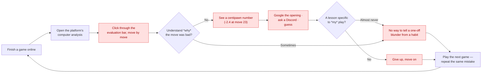
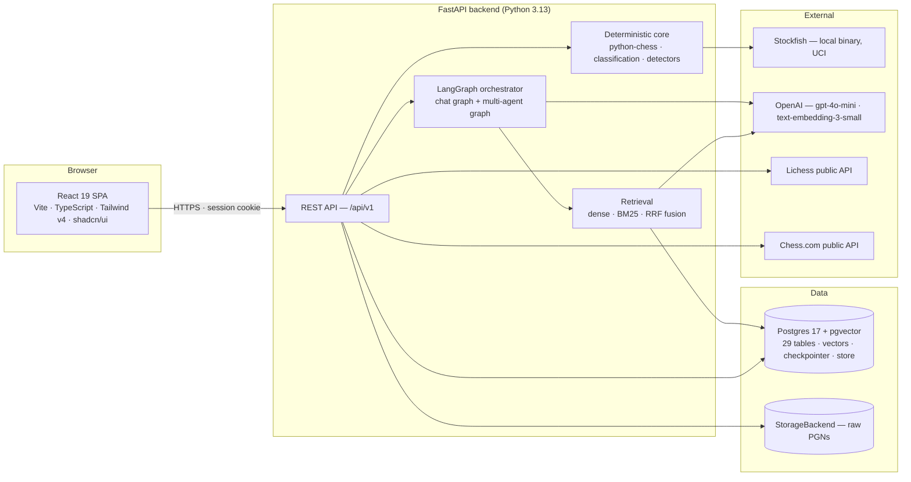

# GrandMate v2 — Certification Challenge Deliverables

The complete deliverables for the AI Makerspace Certification Challenge, structured to the
rubric's seven tasks.

**Live**: frontend at https://grandmate.vercel.app, backend at
https://grandmate-v2-backend.fly.dev. Task 4's deployed, decoupled prototype is met — §4.2
has the evidence.

**Short version**: what runs live, what was built and deliberately not shipped, and how to
read the evaluation numbers — [`production_and_experiments.md`](production_and_experiments.md).

## Contents

1. [Problem definition and target audience](#1-problem-definition-and-target-audience)
2. [Proposed solution and architecture](#2-proposed-solution-and-architecture)
3. [Dealing with the data](#3-dealing-with-the-data)
4. [End-to-end prototype and deployment](#4-end-to-end-prototype-and-deployment)
5. [Evaluation framework and results](#5-evaluation-framework-and-results)
6. [Advanced retrieval and iterative improvements](#6-advanced-retrieval-and-iterative-improvements)
7. [Future reflections](#7-future-reflections)
8. [Next steps](#8-next-steps)

---

## 1. Problem definition and target audience

### 1.1 Problem statement

> Chess engines tell a player *what* went wrong in one game, but nothing tells them **which
> of their mistakes are habits** — so players get a verdict on a single game instead of a
> diagnosis of how they actually play.

The name is **Grand**master + check**mate**, "mate" in its colloquial sense: a companion
rather than a stricter coach or a colder analysis tool, and a layer on top of the sites
people already play on rather than a replacement for them.

### 1.2 The shape of the problem

A player competes regularly with nobody available to review the games afterwards. Without
clear feedback the same mistakes repeat, and motivation drains away. Read back through a
season of those games and the real problem is visible at once — not one bad move, but the
same opening trap walked into game after game.

One blunder is an accident. The same blunder across a season is a habit, and a habit is the
thing a player can actually train away — if anyone tells them it exists. Nobody does. The
hardest part of coaching is pattern recognition across a player's own history, and it is
exactly the part no existing tool performs.

### 1.3 Why the existing tools do not close the gap

| Tool | Good at | Why it does not solve this |
|---|---|---|
| **Engines (Stockfish)** | Exact chess truth — evaluation, best move, principal variation | Per-move and per-game *by construction*. It can say a move lost material; not that it is the fourth time this month |
| **Chess.com / Lichess** | Playing, plus solid single-game review and accuracy scores | Optimised for the game just played, not the pattern across the last sixty |
| **General LLMs** | Sounding like a coach over one pasted game | No cross-game memory, loses track of board state, invents moves that were never played — worse than no explanation, because a learner cannot tell the difference |
| **A human coach** | All of the above, properly | $30–100/hour for roughly one game per session; scales to neither thirty games nor a dozen students |

GrandMate replaces none of them. Stockfish computes the truth, the platforms stay where you
play, and the missing piece — *which of these mistakes are habits, and what should I
practise* — is the product.

### 1.4 Who it is for

The primary user is the **self-directed club player**, roughly 800–1800 rated, who sees
`-2.4` at move 23 and learns nothing they can act on. Two more audiences are served worse
still: a **coach**, who does per-student synthesis by hand, and a **junior player**, for whom
centipawn losses are noise rather than feedback.

Because the language layer may never override the deterministic core, one set of computed
facts can be re-voiced for whoever is reading — which is what makes three audiences one
product rather than three:

| Audience | Wants | Persona | Status |
|---|---|---|---|
| Club player, self-directed | Which mistakes are habits, and what to drill | `self_learner` | ✅ Live |
| Junior player (8–14) | Feedback they can read — no centipawns | `kid` | ✅ Live |
| Coach preparing a lesson | Fast synthesis across a student's games | `coach` | ⚠️ Partial — the persona is live on any profile you can see; the flow that *links* a coach to a student is not built (§8) |
| Parent of a junior | Whether the child is genuinely improving | `coach` | ⚠️ Partial — same limitation, same unblocking work |
| Tournament preparer | An opponent's tendencies | — | Deferred, post-MVP |

A kid gets a supportive story, an adult gets a direct lesson, **and the chess facts
underneath are identical**. That invariant is measured rather than asserted — and it is
currently failing at 94.4%, reported as a failure in §5.3.

### 1.5 Current-state workflow

*Standalone copy with commentary:
[`diagrams/user-workflow-pain-points.md`](diagrams/user-workflow-pain-points.md).*

Red nodes are where the loop fails to produce a lesson. Nothing in it retains anything, so
the next game starts from zero.

### 1.6 Evaluation dataset

Eight versioned datasets across eight suites, each traceable to a concrete scenario file,
seeded position, or test — never to asserted narrative. Design in
[`evaluation_data_design.md`](evaluation_data_design.md); results in
[`evaluation_report.md`](evaluation_report.md).

Representative scenarios, spanning the product's real claims:

| Scenario | What it must prove | Ground truth from |
|---|---|---|
| A move classified `blunder` | Detection agrees with an independent engine | Stockfish at **depth 24**, against a classifier running depth 12 |
| "What was my opening?" | The agent retrieves and cites a real `OpeningMatch` | `game_openings`, seeded |
| "What do I keep getting wrong?" | Routes to profile aggregate, not a single game | `profile_aggregate_snapshots` |
| One game, all three personas | The **fact set is identical** across renderings | The scenario's own fact list |
| Kid persona, complex game | No centipawns; ≤3 findings; low-confidence suppressed | `REPORT_KID_*` settings |
| An answer citing a move never played | The guardrail rejects it before delivery | `game_moves`, seeded |
| "I prefer short answers" | Written to long-term memory above the confidence floor | The scenario's expected kind |
| Assistant offers to remember; user says only "ok" | **Nothing** is written — the durable statement was not the user's | Adversarial negative |
| Out-of-corpus query (Go, football) | Bounds how much junk retrieval returns confidently | Known-negative by construction |

---

## 2. Proposed solution and architecture

### 2.1 Solution in one sentence

> A companion layer over the platforms people already play on: it ingests games, computes
> deterministic engine-backed analysis, detects patterns recurring across many games, and
> explains them differently depending on who is reading — with every generated claim
> verified against the deterministic record before anyone sees it.

### 2.2 Infrastructure and stack

*Standalone copy:
[`diagrams/system-infrastructure.md`](diagrams/system-infrastructure.md).*

The four choices that carried real weight:

| Choice | Why |
|---|---|
| **Stockfish, local, single-threaded** | Free, no per-call cost, deterministic at `ENGINE_THREADS=1`. It is the ground truth everything else is checked against, so it cannot be the stochastic part |
| **Postgres 17 + pgvector** | One engine for relational data *and* vectors, so profile-scoped retrieval joins application tables inside the same authorization boundary rather than across a network hop |
| **LangGraph** | A state graph plus a Postgres checkpointer gives durable multi-turn conversation without building persistence ourselves |
| **OpenAI `gpt-4o-mini`** | Cheap enough per chat turn, behind an `LLMProvider` Protocol so the vendor is one adapter from replaceable |

Every choice, with its rejected alternative and accepted tradeoff, is in
[`ARCHITECTURE.md`](ARCHITECTURE.md) §3.

### 2.3 Agent workflow

One turn is `classify_intent` → `run_agent` → `write_memory`, checkpointed in Postgres. The
agent selects from **eight tools** inside a bounded Python loop, drafts an answer with
citations, and passes it to the grounding guardrail — which retries once, then falls back to
deterministic text rather than ship an unverified claim. `write_memory` runs last, in its
own node, so an extraction failure cannot fail a turn the user has already seen.

**This is agentic RAG, not a retrieve-then-generate chain.** Retrieval is exposed to the
agent *as tools*, so it chooses what to fetch per query rather than running a fixed prefix
step. No tool accepts `profile_id` — one `ToolContext` binds it for the whole turn, so no
model output can request another profile's data.

Diagram and node-by-node reasoning: [`ARCHITECTURE.md`](ARCHITECTURE.md) §4.1.

---

## 3. Dealing with the data

### 3.1 Sources and provenance

| Source | Type | Purpose | Licence / provenance |
|---|---|---|---|
| **User PGN** — paste, file, batch | User-supplied | Primary ingestion; one endpoint handles all three | User's own |
| **Lichess API** | External REST | Account existence at login; public archives at import | Public, unauthenticated |
| **Chess.com API** | External REST | Same two purposes | Public, unauthenticated |
| **`lichess-org/chess-openings`** | Vendored dataset | ~3,800 EPD-keyed entries for ECO identification | **CC0 1.0** — commit pinned; `PROVENANCE.md` records source, commit, date, reviewer |
| **FIDE Laws of Chess** | Vendored PDF | The `rules` bucket | **Licence unclear** — recorded as unresolved rather than invented, per an explicit owner decision |
| **Authored corpus** | Original prose | Tactics, openings, strategy, engine semantics | Original; cross-checked against reference material, no text reproduced |
| **Stockfish** | Local binary | All evaluation ground truth | GPL, run as a subprocess |
| **OpenAI** | External API | Completions and embeddings | Commercial |

**Provenance is enforced, not documented.** `domain/knowledge/provenance.py` parses a
required header (`Title` / `Source` / `Source-URL` / `Licence` / `Retrieved`) from every
corpus document and **rejects** any that is missing a field. A document without provenance
cannot enter a bucket.

### 3.2 Chunking strategy

Five buckets, **two chunkers** — deliberately not a token-size knob per bucket. The
per-bucket breakdown is in [`ARCHITECTURE.md`](ARCHITECTURE.md) §8; the reasoning belongs
here.

- **`chunk_markdown_by_heading`** — one `##` section per chunk, for the four authored
  buckets. A motif is atomic (half a fork explanation retrieves as noise); an opening family
  split across chunks loses the ECO range that defines it; a strategic theme is one theme.
- **`chunk_by_tokens`** (`CHUNK_SIZE_TOKENS=512`, overlap 64) — for the one genuinely
  unstructured input, the FIDE PDF, whose extracted text has no headings left to exploit.
  The overlap keeps an article and its clauses together across a boundary.

**Why not per-bucket token targets.** Every authored document is already written at the
granularity its bucket calls for, so heading boundaries *are* the correct chunk boundaries;
a token target would cut across them and could not improve on them. And
`chunk_markdown_by_heading` **raises** if a document has no `##` headings, so a
badly-formatted document fails ingestion instead of silently becoming one enormous chunk.

The fifth bucket, `analysis`, is chunked one finding per chunk — the unit a coach reasons
about — and is **profile-scoped** behind a `NOT NULL profile_id`.

---

## 4. End-to-end prototype and deployment

### 4.1 What is built

A decoupled full-stack application: FastAPI backend, React SPA frontend, no shared
dependency graph, path-scoped CI per side.

**Backend** — 12 route modules, 15 domain modules, 29 tables, reversible Alembic migrations
tested up→down→up. The deterministic core (ingestion, canonical game objects,
tiered Stockfish analysis, 10 tactical motifs, 10 strategic themes, aggregation) is kept
structurally separate from the generative layer by a CI-enforced layer-boundary check.

**Frontend** — 14 features across three routes (`/`, `/login`, catch-all). Import, Games,
Dashboard, Chat, Memory and Game-Detail were six separate pages earlier in the build; they are
now panels and tabs in one workspace shell, so the surface is a single application screen
rather than a set of destinations.

**Two product decisions worth naming**, both about refusing to lead with maths:

- **A game opens as a story.** The Story tab narrates opening, middlegame and endgame in the
  reader's persona voice, from the same deterministic facts, with its own grounded fallback.
  The engine-detail tabs ("Moves", "Patterns") are opt-in behind a persisted switch.
- **The dashboard refuses to overclaim a habit.** Below `ANALYTICS_MIN_GAMES_FOR_TREND`
  (default 5) analysed games, trends are computed but flagged `sufficient_sample=False`
  rather than asserted — two bad games are not a trend. A weakness must recur in at least
  `ANALYTICS_WEAKNESS_MIN_OCCURRENCE_RATE` (default 30%) of the window to be named.

**Verified end to end** against real Postgres, a real Stockfish binary, and real
`gpt-4o-mini` calls — not mocks. The full path: connect a Lichess or Chess.com account (or
paste a PGN) → background analysis completes → read the story, then classifications,
opening, motifs and themes → open the dashboard for recurring weaknesses and a training plan
→ switch personas → ask a question in chat and get a cited answer → say "I prefer short
answers" and see it persist to the memory audit page, where it can be deleted.

Capability-by-capability, with the module behind each:
[`production_and_experiments.md`](production_and_experiments.md) §1.

### 4.2 Deployment — met

| | |
|---|---|
| Frontend | https://grandmate.vercel.app (Vercel) |
| Backend | https://grandmate-v2-backend.fly.dev (Fly.io, `sjc`) |
| Database | Neon Postgres 17 + pgvector 0.8.0, AWS `us-west-2` |

Decoupled as the rubric asks: two hosting providers, two toolchains, no shared dependency
graph, talking over a typed HTTP contract.

**Verified against the live stack, not asserted** — `/ready` returns
`missing_configuration: []` with `stockfish_binary: true`, the corpus holds 92 chunks across
four buckets, the SPA rewrite serves deep links, CORS preflight returns the exact origin with
credentials allowed, and the full path was walked in a browser. Evidence table:
[`DEPLOYMENT.md`](DEPLOYMENT.md) §9.

**Seven problems stood in the way, and three were findable only by deploying**: Stockfish
sitting at a different path on Debian than on a developer's machine (container healthy,
nothing ever analysed, because no request path touches the engine); `scripts/` missing from
the image, so the ingest command this documentation told an operator to run did not exist;
and a fix for one problem deadlocking against another, since the backend refused to start
without the frontend's origin while the frontend could not build without the backend's URL.
Leaving the verification table empty rather than filling it from intent is what kept that
visible. Full account: [`DEPLOYMENT.md`](DEPLOYMENT.md) §0.

**Still not verified**: load of any kind, recovery from a mid-analysis restart
(`min_machines_running = 1` is a workaround for the absent worker, not a replacement),
Vercel preview origins, and cost over a full billing period.

---

## 5. Evaluation framework and results

### 5.1 The rule that makes these numbers falsifiable

**Ground truth never comes from the code being graded.** A retrieval query whose correct
chunk was chosen by the retriever, or a move label produced by the classifier being scored,
measures self-consistency and reports it as accuracy — silently, and with excellent numbers.
Two corollaries, both enforced in the harnesses: a metric that could not be measured is
reported as *not measured* rather than defaulted to a pass, and a synthetic set is never read
as though it were the golden set.

### 5.2 The harness

Three layers — **deterministic** (free, exactly reproducible), **judged** (real cost,
run-to-run variance), and **structural** (not sampled at all; properties the code guarantees,
verified against real Postgres). Conflating them is how an evaluation section becomes a
rubber stamp. What belongs in each, and how to read a 100% from one versus another:
[`production_and_experiments.md`](production_and_experiments.md) §3.1.

Eight suites, each with a versioned dataset and a timestamped run record.
[`evaluation_report.md`](evaluation_report.md) is **generated** from those records by
`backend/evals/report.py`, so no figure in it can drift from the run it describes.

### 5.3 Results and conclusions

Full tables in [`evaluation_report.md`](evaluation_report.md). The conclusions that matter:

**The deterministic core is sound, and the test proving it can fail.** Detection F1 **1.000**
and severity accuracy **0.750** against an independent depth-24 oracle (n=24). The negative
control — the same harness against deliberately corrupted thresholds — collapses to F1
**0.500** and severity **0.125**. A test that cannot fail proves nothing, so the collapse
matters more than the passing score. Per class, `inaccuracy` is weakest (F1 0.571), which is
the expected place for a classifier to disagree with an oracle.

**Grounding is structurally guaranteed and measured at 100%.** `grounded_rate` and
`intent_valid_rate` are both 100% — by construction, not by sampling. Observed live: on one
real game the kid persona failed grounding twice and fell back to the deterministic summary
while self-learner and coach succeeded, in the same session.

**⚠️ A hard-gated metric is failing.** `fact_invariance_rate` is **94.4%** on the 30-scenario
persona run, against a zero-tolerance target. An earlier 5-scenario run scored 100%; the
expanded set found a real violation of the product's central claim. An open item, not a
passing result — listed with everything else failing or missing in
[`production_and_experiments.md`](production_and_experiments.md) §4.

**Faithfulness is 0.701, and understood**, alongside a 100% `grounded_rate`. Not a
contradiction: the two score different objects by different mechanisms, and the sentences
pulling faithfulness down are coaching advice that no corpus passage can entail — not
fabricated chess claims, of which manually reading every answer in the run found none. The
threshold was recalibrated from 0.85 to 0.70 on that reasoning, which is a statement about
what the metric can measure here, **not** an improvement in the score: the score did not
move. The correct fix — splitting the answer contract into facts and advice so faithfulness
scores only the facts — is not done. Full argument:
[`production_and_experiments.md`](production_and_experiments.md) §3.2.

**Multi-agent orchestration was evaluated and not adopted.** Single-agent faithfulness 0.600
vs multi-agent 0.504; relevancy 0.406 vs 0.118. Against a pre-declared exit criterion, it did
not clear the bar, so the supervisor graph stays built, tested and unrouted behind
`USE_MULTI_AGENT=false`. The run is flagged `directional_only` — 12 scenarios can show it did
not clear the bar, not quantify the gap. Why it lost, from the transcripts:
[`production_and_experiments.md`](production_and_experiments.md) §2.1.

**Limitations, stated rather than found by a reviewer.** The golden sets are reviewed, but by
their own author — that catches errors, not blind spots the author shares, so independent
review is still the highest-value improvement available. Sample sizes are small (24 classifier
positions, 12 trajectory scenarios). Retrieval "semantic" queries retain vocabulary overlap
with their source chunks, which structurally favours BM25. Everything is scored against one
model.

---

## 6. Advanced retrieval and iterative improvements

### 6.1 Advanced retrieval: hybrid RRF over a bucket-routed index

**The problem.** Dense vector search generalises away exactly the terms chess runs on — an
ECO code like `C89`, a coordinate like `e4`, a name like "Marshall Attack" — and returns
diluted results. Sparse search catches those and misses conceptual paraphrase.

**The implementation.** Dense (pgvector) and sparse (BM25) fused by **reciprocal rank
fusion**, over five buckets with a heuristic router (`select_buckets`) choosing which to
search. The bucket filter applies *before* fusion, so rules language cannot bleed into
strategy advice. All three strategies run through the same production entry point, so the
benchmark measures what the application actually does. Subsystem detail:
[`ARCHITECTURE.md`](ARCHITECTURE.md) §8.

### 6.2 Retrieval comparison — baseline vs advanced

Measured over 41 corpus-derived queries (17 lexical, 19 semantic, 5 negative) against a
92-chunk index, scored by RAGAS non-LLM context precision and recall.

| Retriever | Context precision | Context recall | MRR | Negative FP rate |
|---|---|---|---|---|
| Dense (baseline) | 0.907 | 0.951 | 0.914 | 100% |
| Sparse / BM25 (baseline) | 0.927 | **0.983** | 0.921 | 100% |
| **Hybrid RRF (advanced)** | **0.936** | 0.977 | **0.949** | 100% |

**Honest reading**: hybrid has the best context precision and the best MRR, but sparse edges
it on recall — so hybrid does **not** beat both baselines on both metrics, and the project's
pre-declared rule ("if hybrid does not beat both baselines, the simpler retriever ships") was
not satisfied. **Hybrid ships anyway**: `search_knowledge` calls `hybrid_search` directly.
The defensible part is that these gaps sit inside the noise of a 92-chunk corpus and 41
queries, and that MRR — the metric hybrid wins — is what matters for an agent reading the top
result first. The honest part is that the rule said switch and the switch was not made.
Recorded in [`production_and_experiments.md`](production_and_experiments.md) §2.2 rather than
presented as a clean win.

**A known gap, measured**: with `RETRIEVAL_MIN_SCORE=0.0` every retriever returns its `top_k`
regardless of relevance, so all five out-of-corpus queries produce a false positive at every
strategy. A measured consequence of a configuration default, not a retrieval defect — but it
means the negatives currently measure the absence of a threshold.

### 6.3 Second improvement: detector precision from external ground truth

The tactical motif detectors were first validated only against hand-built positions — the
detector grading its own homework. The improvement was to score them against **real,
independently tagged Lichess puzzles** (CC0), where ground truth is Lichess's own
community-vetted theme tag.

**That immediately found a real bug.** Both `skewer` puzzles failed: `skewer.py` required the
front piece's trade value to exceed the back piece's, but `PIECE_VALUES_CP[KING] == 0` by
design — so the textbook case where a *king* is checked and forced to move, exposing a
valuable piece behind it, could never satisfy the comparison. Fixed, with a regression test
built from one of the two puzzles that caught it.

| | Before | After |
|---|---|---|
| Recall on tagged puzzles | 18 / 20 | **20 / 20** |
| False positives on near-miss fixtures | 0 / 10 | **0 / 10** |

---

## 7. Future reflections

### 7.1 What worked, and should stay

**Deterministic ground truth, structurally separated.** The layer-boundary check that fails
CI if `domain/analysis` acquires an LLM import is the single most valuable rule in the
codebase — it is why "the LLM never computes chess truth" is a property rather than an
aspiration.

**Guardrails with a fallback, not a refusal.** Never showing an ungrounded claim *and* never
showing an error are both requirements; retry-then-deterministic-fallback satisfies both, and
disclosing which path produced the text keeps it honest.

**Evaluating against ground truth the system did not produce.** The depth-24 oracle and the
Lichess puzzle tags each found a real defect internal fixtures had not. The negative control
is the practice most worth carrying into any new suite.

**Being bound by a pre-declared exit criterion.** Multi-agent orchestration was built,
scored, and dropped because it lost — the same discipline as fixing the skewer bug. The
evaluation decided, not the intuition.

### 7.2 What to change

The complete list of what is failing, missing, or knowingly compromised is kept in one place
— [`production_and_experiments.md`](production_and_experiments.md) §4 — rather than scattered
through this document. The three that would change decisions:

**Resolve the `fact_invariance_rate` regression.** A zero-tolerance metric at 94.4% is an
open defect, not a rounding error, and it sits on the claim the whole product rests on.

**Get the golden sets independently reviewed.** They are author-reviewed today, which catches
errors but not shared blind spots. A second reader is the highest-value improvement available
to the evaluation programme, and it needs a reader rather than code.

**Split the answer contract into facts and advice.** It would let faithfulness score only the
sentences it was ever meant to score, and make the advice surface explicit rather than
implicit (§5.3).

---

## 8. Next steps

Ordered by dependency and payoff.

| # | Item | Scope | Why here |
|---|---|---|---|
| 1 | **Investigate `fact_invariance_rate` at 94.4%** | Evaluation; small | A failing zero-tolerance metric on the central claim outranks every new feature |
| 2 | **Human-review and enlarge the golden sets** | No code; a reading task | Unlocks every judged metric from "informative" to "gating" — and the one metric that has failed did so only once its set grew |
| 3 | **Interactive chessboard, then voice** | Frontend-led | Moves are shown as a table and UCI (`e2e4`) rather than SAN on a board; largest visible gain per unit of effort |
| 4 | **Split the answer contract into `facts[]` and `advice[]`** | Backend contract + consumers | Makes faithfulness measure what it was meant to measure (§5.3) |
| 5 | **LangSmith tracing + LangGraph Studio** | ADR-0017 already written | The deployed agent runs unobserved, which is not operable — and is a prerequisite for real users |
| 6 | **A small pilot cohort, then gradual expansion** | Product, not code | Real usage is the only source of feedback golden sets cannot supply |
| 7 | **Coach and parent accounts — the linking flow** | New flow + permission gate | The persona and permission model exist; nothing creates a relationship row, so this is the audience in §1.4 only partly served |
| 8 | **A real background worker** | Read the existing `jobs` table out of process | `BackgroundTasks` loses work the moment the process stops; the table was designed for this |
| 9 | **Deeper habit tracking and progress over time** | Analytics + UI | The premise is habits; showing a player a habit *shrinking* is what sustains motivation |
| 10 | **Plain-English engine lines** | Prompt + contract | Translating a principal variation into the plan behind it — *"a3 stops the knight coming to b4"* — is the part players cannot read for themselves |

---

## Evidence index

| Claim | Where to verify it |
|---|---|
| What runs live, what was dropped, every known failure | [`production_and_experiments.md`](production_and_experiments.md) |
| Architecture and design invariants | [`ARCHITECTURE.md`](ARCHITECTURE.md) |
| Every diagram, standalone | [`diagrams/`](diagrams/) |
| Measured evaluation results | [`evaluation_report.md`](evaluation_report.md) — generated from run records |
| Dataset design and limitations | [`evaluation_data_design.md`](evaluation_data_design.md) |
| Raw run records behind every number | [`../backend/evals/runs/`](../backend/evals/runs/) |
| Deployment steps, problems, verification | [`DEPLOYMENT.md`](DEPLOYMENT.md) |
