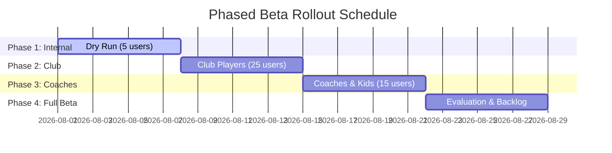

# Beta Cohort Plan — GrandMate

This document outlines the rollout phases, target demographics, and onboarding workflow for the GrandMate beta test. The goal of the beta is to validate the usefulness of recurring habit-tracking, persona-adapted game reports, and agentic RAG chat in real-world scenarios.

---

## 1. Target Cohort Demographics

To evaluate GrandMate's value proposition across its three primary target personas, we will source a cohort of **35–50 participants** split into three specific segments:

| Segment | Target Count | Persona Mapping | Primary Use Case |
|---|---|---|---|
| **Self-Directed Club Players** | 20–25 | `self_learner` | Paste/import recent games to check recurring blunders, opening stats, and chat about specific positions. |
| **Chess Coaches** | 5–10 | `coach` | Manage multiple student profiles, quickly inspect student game history before lessons, and generate lesson summaries. |
| **Junior Players (Under 14)** | 10–15 | `kid` | Read simplified game summaries without heavy centipawn numbers, and ask basic questions to the chat assistant. |

---

## 2. Phased Rollout Schedule

We will execute a 4-week structured rollout to mitigate system load risks (especially Stockfish CPU cycles and OpenAI token budget usage):

### Phase 1: Developer & Internal Dry Run (Week 1)
* **Cohort Size**: 5 internal users (developers + project owners).
* **Objective**: Smoke-test the Lichess/Chess.com import pipelines and check for raw database connection leaks, memory usage spikes, and rendering defects.
* **OpenAI Spending Limit**: capped at $2.00/day.

### Phase 2: Club Player Expansion (Week 2)
* **Cohort Size**: 20–25 players recruited from local chess clubs.
* **Objective**: Evaluate the accuracy of motif detectors and the usefulness of the self-learner dashboard over windows of 10/30/60 games.
* **OpenAI Spending Limit**: capped at $15.00/day.

### Phase 3: Coach and Junior Player Onboarding (Week 3)
* **Cohort Size**: 5 coaches and 10 junior students.
* **Objective**: Test the multi-profile workspace switcher and persona-sensitive rendering accuracy (kid safety, coach technical detail levels).
* **OpenAI Spending Limit**: capped at $30.00/day.

### Phase 4: Full Cohort Evaluation & Synthesis (Week 4)
* **Cohort Size**: All active participants (approx. 40–50 users).
* **Objective**: Execute the feedback rubric, compile evaluation metrics, and prioritize the post-beta development backlog.

---

## 3. Onboarding & Provisioning Workflow

To ensure smooth user onboarding while respecting the deferred identity oauth strategy (ADR-0014):

1. **Invitation & Access**:
   * Users receive a unique invitation link via email or Discord.
   * Access is routed through the main URL (`app.grandmate.dev`).
2. **Profile Setup**:
   * Users register using their Lichess username.
   * Option to link a Chess.com username during registration to enable cross-platform game aggregation.
3. **PGN Ingestion**:
   * On first login, users are prompted to import their last 30 games (either automatically via Lichess API or by uploading a PGN file).
   * Webhook/polling triggers Stockfish background tasks. A progress bar displays state to the user.
