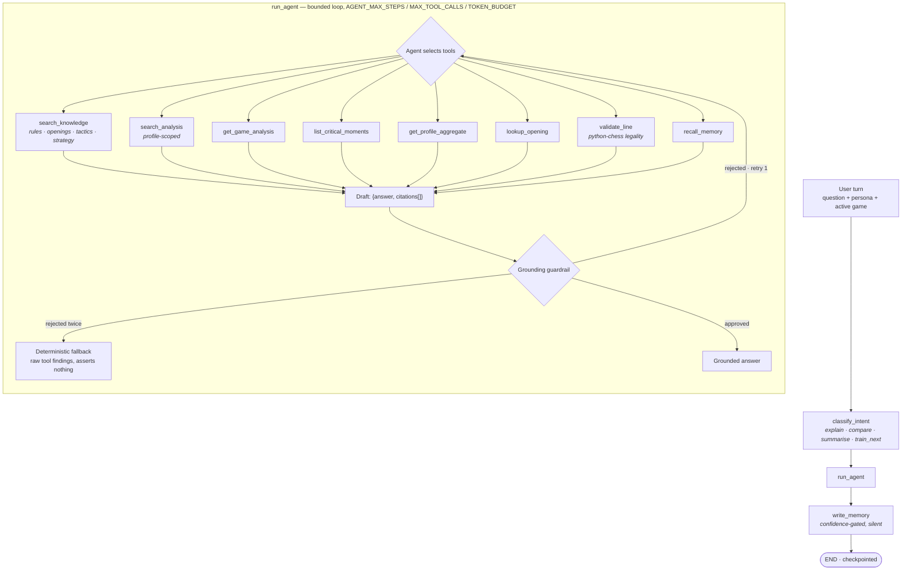

# Agent workflow — the chat graph

Referenced from [`ARCHITECTURE.md` §4.1](../ARCHITECTURE.md#41-chat-graph--the-production-path)
and [`Deliverables.md` §2.3](../Deliverables.md#23-agent-workflow).

The graph that serves production traffic. Three nodes; the agent's tool selection is a
bounded Python loop inside the middle one.

## Reading notes

**Intent classification is LLM-based, and cannot produce an invalid intent.** User phrasing
is open-ended natural language, so a keyword heuristic would misroute; but the classifier
always falls back to a valid taxonomy member, which is why `intent_valid_rate` is 100% by
construction rather than by luck.

**Eight tools, none of which accepts `profile_id`.** One `ToolContext` binds the profile
for the whole turn. No tool's JSON schema exposes it, so there is no code path a model
could use to request another profile's data — proven directly by a stray-argument test.

**The loop is Python, not graph edges.** Modelling each tool call as a node would push
intra-turn scratch work into checkpointed state. Only the user/assistant exchange is
persisted, so a long conversation's stored size grows with turn count rather than
tool-call count.

**`write_memory` cannot fail the turn.** It runs after the answer is settled, so extraction
can never change what the user was already told, and an extraction error does not lose the
response.
