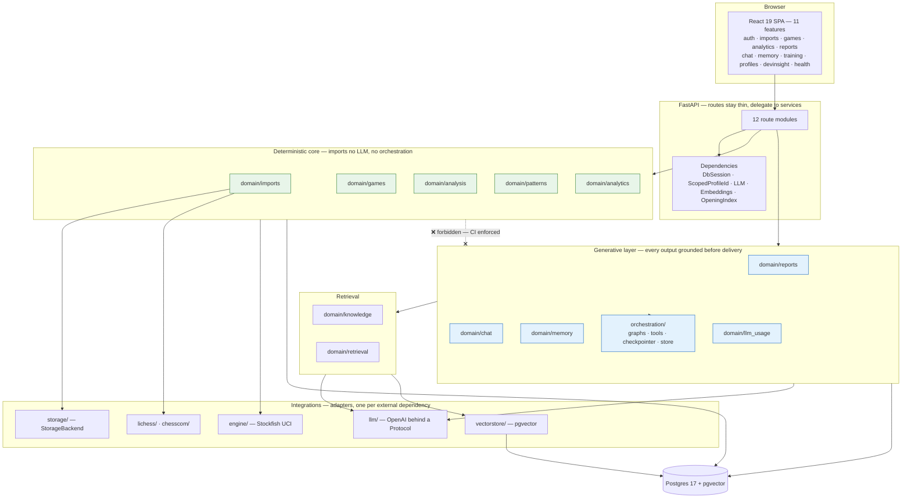

# Component architecture

Referenced from [`ARCHITECTURE.md` §2](../ARCHITECTURE.md#2-component-architecture).

Module-level view. The boundary between the deterministic core and the generative layer is
the one that is enforced by a CI check rather than by convention.

## The one edge that is a rule

`tests/test_layer_boundaries.py` runs as its own CI step and fails the build if any module
in the green cluster acquires an import from the blue cluster or from an LLM package. It
was written before there was any deterministic core to check — its own six
self-tests ran against a synthetic fixture until there were real modules for it to
police.

The dependency in the other direction is allowed and deliberate: `domain/imports` imports
`domain/games` because ingestion needs canonicalization. One-directional, documented, and
the reverse would be the design error.
