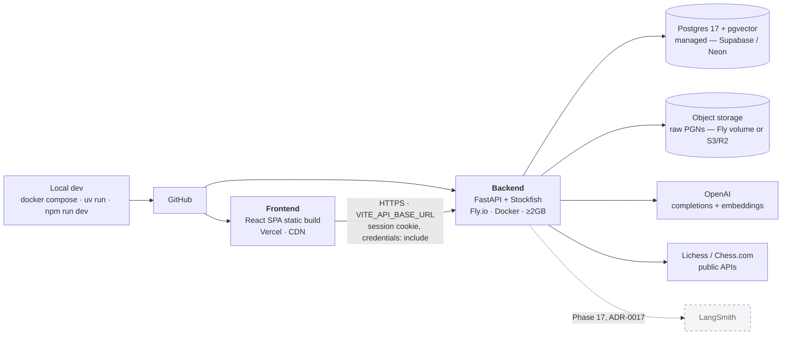

# Deployment topology — planned

Referenced from [`ARCHITECTURE.md` §11](../ARCHITECTURE.md#11-deployment-topology--planned-not-yet-built)
and [`DEPLOYMENT.md`](../DEPLOYMENT.md).

> ⚠️ **Nothing in this diagram has been deployed.** The hosting decision belongs to
> Phase 17, deferred from Phase 0 (D-006). This is the target, not the current state.

## What this diagram hides, and shouldn't

Four things must be fixed before any of the above works. All four were found by reading the
code, none has been worked around, and each is detailed in [`DEPLOYMENT.md`](../DEPLOYMENT.md).

1. **The container crashes at startup.** The Dockerfile copies only `app/`, so the vendored
   opening dataset never reaches the image — and `lifespan` loads it unconditionally.
2. **Migrations cannot run.** `alembic/` and `alembic.ini` are not copied either.
3. **Login silently fails across origins.** The session cookie is `SameSite=Lax`;
   `*.vercel.app` → `*.fly.dev` is cross-site, so the browser accepts the cookie at login
   and then never sends it.
4. **Background jobs get killed.** Analysis and platform imports run via `BackgroundTasks`
   *after* the response is sent; an auto-stopping machine dies mid-Stockfish.

The two edges worth noting on the diagram itself:

**The dashed cookie path is the fragile one.** A shared parent domain
(`app.grandmate.dev` / `api.grandmate.dev`) keeps `SameSite=Lax` working. Platform
subdomains do not, because `fly.dev` and `vercel.app` are both on the Public Suffix List.

**Object storage is a real decision, not plumbing.** `domain/games/service.py` reads raw
PGNs back out of storage during canonicalization, so an ephemeral container filesystem
loses them. A Fly volume pins the app to one machine; an S3/R2 adapter does not — and
`StorageBackend` was built for exactly that swap.
