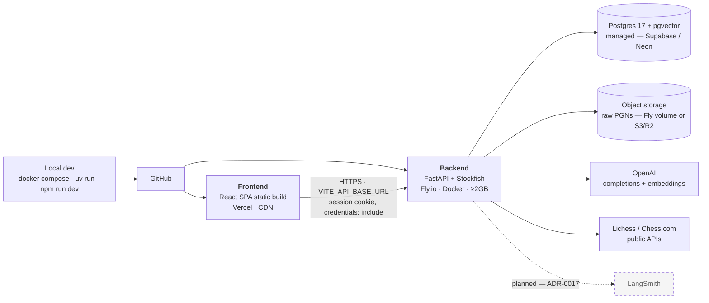

# Deployment topology — live

Referenced from [`ARCHITECTURE.md` §11](../ARCHITECTURE.md#11-deployment-topology--live)
and [`DEPLOYMENT.md`](../DEPLOYMENT.md).

> ✅ **Deployed and verified, 2026-08-04.** Frontend https://grandmate.vercel.app, backend
> https://grandmate-v2-backend.fly.dev (Fly `sjc`), Neon Postgres 17 + pgvector in AWS
> `us-west-2`. Evidence in [`DEPLOYMENT.md`](../DEPLOYMENT.md) §9.

## What this diagram hid, and shouldn't have

A topology diagram makes deployment look like a wiring problem. Seven things stood between
this picture and a working system, all now fixed and detailed in
[`DEPLOYMENT.md`](../DEPLOYMENT.md) §0.

Four were predicted by reading the code: the image lacked `data/` (crash loop) and
`alembic/` (no migrations); the session cookie was hardcoded `SameSite=Lax`, which breaks
cross-site login; and background jobs died with an auto-stopping machine.

**Three were not, and they are the ones a diagram can never show.** Stockfish was not at
the configured path, so the container reported perfectly healthy and analysed nothing.
`scripts/` was missing from the image, so the documented corpus-ingestion command did not
exist. And a fix for a fifth problem deadlocked the deploy — treating a placeholder CORS
origin as required made the backend refuse to start until the frontend existed, while the
frontend could not be built until the backend did.

The two edges worth noting on the diagram itself:

**The dashed cookie path is the fragile one.** A shared parent domain
(`app.grandmate.dev` / `api.grandmate.dev`) keeps `SameSite=Lax` working. Platform
subdomains do not, because `fly.dev` and `vercel.app` are both on the Public Suffix List.

**Object storage is a real decision, not plumbing.** `domain/games/service.py` reads raw
PGNs back out of storage during canonicalization, so an ephemeral container filesystem
loses them. A Fly volume pins the app to one machine; an S3/R2 adapter does not — and
`StorageBackend` was built for exactly that swap.
