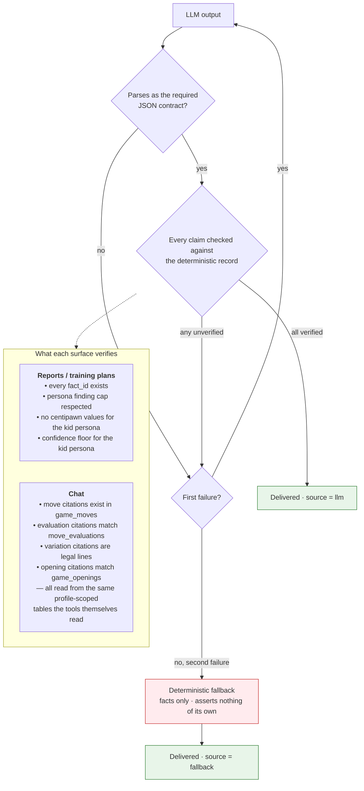

# Grounding guardrail

Referenced from [`ARCHITECTURE.md` §9](../ARCHITECTURE.md#9-grounding--how-an-ungrounded-claim-is-stopped).

How a claim the deterministic record does not support is stopped before a reader sees it.
Two independent implementations — one per generative surface — with the same shape.

## Reading notes

**The reader never sees an error, and never sees an unverified claim.** Those two
properties together are why the fallback exists — refusing to answer would satisfy the
second and violate the first.

**Which path produced the text is disclosed, not hidden.** The API returns a `source`
field and the UI carries a badge. A fallback report is visibly a fallback.

**`grounded_rate` is 100% by construction.** It is not a judge's estimate — the
retry-then-fallback loop makes any other value structurally impossible. That is worth
stating plainly, because a 100% metric that came from an LLM judge would mean much less.

**Observed live, not simulated.** On one real game, the kid persona failed grounding twice
and fell back to the deterministic summary, while self-learner and coach both succeeded on
the same game in the same session — a small model over-generating past a strict finding
cap, and the critic catching it both times.

**The LLM critic in the multi-agent graph does not replace this.** That critic is an
additional agent-level check; the deterministic guardrail is what actually gates delivery.
An LLM approving an ungrounded claim must never be the only thing between a model and a
reader.
