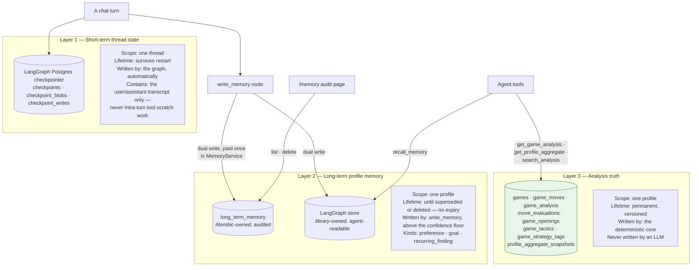

# Three-layer memory model

Referenced from [`ARCHITECTURE.md` §7](../ARCHITECTURE.md#7-memory-design--three-layers-deliberately-not-one)
and [ADR-0005](../../final_docs/v2/adr/0005-three-layer-memory-model.md).

Three storage models, deliberately not collapsed into one. Collapsing them is the common
shortcut and it is the thing this design refuses.

## Reading notes

**Why layer 2 writes twice.** The audited table is what the UI lists and deletes from; the
store is what the agent actually reads mid-conversation. ADR-0005 called this a
"deliberate extra cost" — it is paid once inside `MemoryService.write_candidate_memories`
rather than left for every caller to keep the two in sync.

**Superseded, not overwritten.** A replaced `preference` or `goal` keeps its row with
`superseded_at` set, and the audit page shows it dimmed as "No longer active." The entire
point of superseding rather than overwriting is that a wrong memory stays traceable.
Deleting is different and stronger: a real removal from both stores.

**`recurring_finding` accumulates where the others replace.** A player can genuinely have
several distinct recurring weaknesses at once, so those deduplicate only against an exact
repeat rather than superseding each other.

**Layers 1 and 2 are library-owned DDL, not Alembic migrations.** `alembic/env.py` carries
an `include_object` filter on `checkpoint*`/`store*` prefixes so autogenerate cannot
propose dropping them — a real failure the first Phase 11 migration attempt produced before
the filter existed.

**Extraction reads only what the user said.** An evaluation scenario deliberately checks
the adversarial case: the assistant replies "I will remember that you want to focus on
defense" and the user says only "ok" — nothing is written, because the durable statement
was never the user's.
