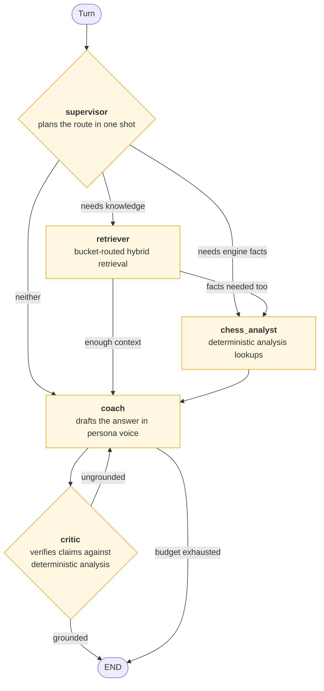

# Multi-agent supervisor graph

Referenced from [`ARCHITECTURE.md` §4.2](../ARCHITECTURE.md#42-multi-agent-supervisor-graph--built-evaluated-not-routed).

Five agents under a supervisor, with a critic that loops back. **Built, tested, and
evaluated head-to-head against the single agent — deliberately not wired to any API route
yet**, pending the evidence-based ship decision Phase 13 was scoped to make.

## Reading notes

**Every node checks the budget before doing work.** `MULTI_AGENT_MAX_STEPS`,
`MULTI_AGENT_MAX_TOOL_CALLS`, and `MULTI_AGENT_TOKEN_BUDGET` are separate from — and larger
than — the single-agent ceilings, because this budget is spent across up to five agents in
one turn rather than one. A node that finds the budget exhausted records
`skipped="budget_exhausted"` in its span and returns, rather than silently overrunning.

**The critic is a separate agent, not a regex.** It is the multi-agent analogue of the
chat graph's deterministic guardrail — but note that the *deterministic* guardrail is the
one that actually gates delivery. An LLM critic that approves an ungrounded claim must not
be the only thing standing between a model and a reader.

**Why it is not routed yet.** Phase 13 was scoped to decide on evidence whether
multi-agent orchestration ships. The trajectory evaluation runs both graphs against the
same seeded scenarios and scores them identically; the recorded run is in
[`evaluation_report.md`](../evaluation_report.md). Wiring it to a route before that
decision would have prejudged it.
