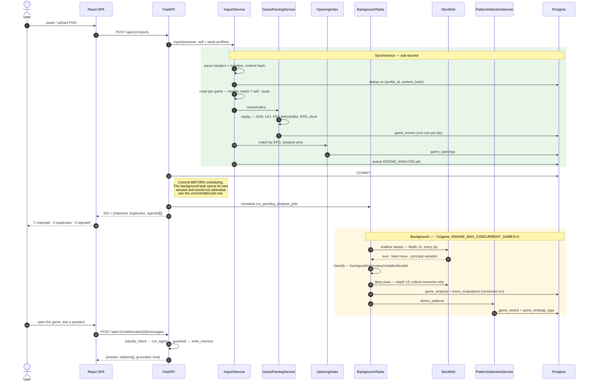

# Request lifecycle — PGN to coaching answer

Referenced from [`ARCHITECTURE.md` §5](../ARCHITECTURE.md#5-request-lifecycle--pgn-to-coaching-answer).

What one `POST /api/v1/imports` actually triggers, across a synchronous request, a
background job, and a later interactive turn.

## Why the commit annotation is there

That step is a real defect that shipped in Phase 5 and was fixed in Phase 7.

The route created the `Job` row on the *request's* session, then handed the id to
`BackgroundTasks`, which opens a **separate** session. Under normal read-committed
isolation that second session ran `session.get(Job, job_id)` before the first had
committed, got `None`, and a defensive "job vanished" guard treated the race as a no-op.
No exception, no log, no Stockfish process — every job stayed `pending` forever.

It reproduced 100% of the time and was invisible to the test suite, because the automated
tests called the dispatcher directly and never exercised the real HTTP →
`BackgroundTasks` → dual-session path. It was found by manual browser testing during a
later phase. The regression test now exercises that real path specifically.
