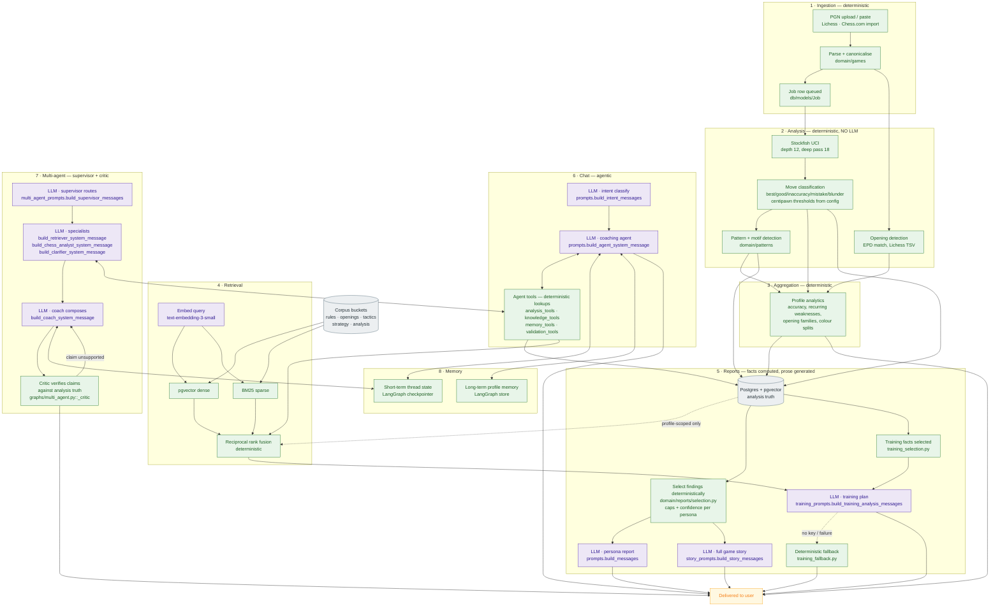

# System flow — deterministic vs LLM, end to end

One diagram covering every feature: what happens deterministically, where the LLM is
invoked, and which prompt builder each LLM call uses.

**The rule this diagram exists to make visible:** chess truth is computed, never
generated. Stockfish and the detectors produce facts; the LLM only words them. No LLM
call decides whether a move was a blunder (`claude.md` rule 8).

## Legend

| Style | Meaning |
|---|---|
| **Deterministic** | Engine, parsing, detectors, aggregation, SQL. Same input → same output. No API key needed. |
| **LLM** | An OpenAI completion. Labelled with the prompt builder that constructs its messages. |
| **Retrieval** | pgvector dense + BM25 sparse, fused by RRF. Embeddings are an API call; fusion is deterministic. |

## Every LLM call, and its prompt

| # | Feature | Prompt builder | Module |
|---|---------|----------------|--------|
| 1 | Persona report | `build_messages` | `domain/reports/prompts.py` |
| 2 | Full game story | `build_story_messages` | `domain/reports/story_prompts.py` |
| 3 | Training plan | `build_training_analysis_messages` | `domain/reports/training_prompts.py` |
| 4 | Chat intent classification | `build_intent_messages` | `domain/chat/prompts.py` |
| 5 | Chat coaching agent | `build_agent_system_message` | `domain/chat/prompts.py` |
| 6 | Multi-agent supervisor | `build_supervisor_messages` | `domain/chat/multi_agent_prompts.py` |
| 7 | Retriever specialist | `build_retriever_system_message` | `domain/chat/multi_agent_prompts.py` |
| 8 | Chess-analyst specialist | `build_chess_analyst_system_message` | `domain/chat/multi_agent_prompts.py` |
| 9 | Clarifier specialist | `build_clarifier_system_message` | `domain/chat/multi_agent_prompts.py` |
| 10 | Coach composer | `build_coach_system_message` | `domain/chat/multi_agent_prompts.py` |

Each of these files also defines a `BASE_SYSTEM_PROMPT` / `_*_SYSTEM_PROMPT` constant
holding the role and guardrail text the builder wraps around per-request content.

Embeddings (`text-embedding-3-small`) are the eleventh API call, made during corpus
ingestion and on every retrieval query.

## What needs no API key

Everything in green: ingestion, Stockfish analysis, move classification, motif and theme
detection, opening detection, profile analytics, RRF fusion, the agent's tool lookups,
and the critic's verification. With a blank `OPENAI_API_KEY` the app starts and every
number it shows is still real — only generated prose is unavailable, because
`build_llm_provider` returns a stand-in that fails on the first completion call rather
than at startup.

## The boundary that matters

Reports and chat never assert chess truth on their own authority:

- Report prose is built from findings already selected deterministically from the
  database (`selection.py`, `training_selection.py`).
- Chat answers are grounded in tool results, which read the same analysis tables.
- The multi-agent path adds a critic that checks claims against deterministic analysis
  before delivery, looping back to the coach when a claim is unsupported.

The `analysis` retrieval bucket is profile-scoped at the retriever interface, so a
retrieval cannot cross a profile boundary without an explicit permission grant.
