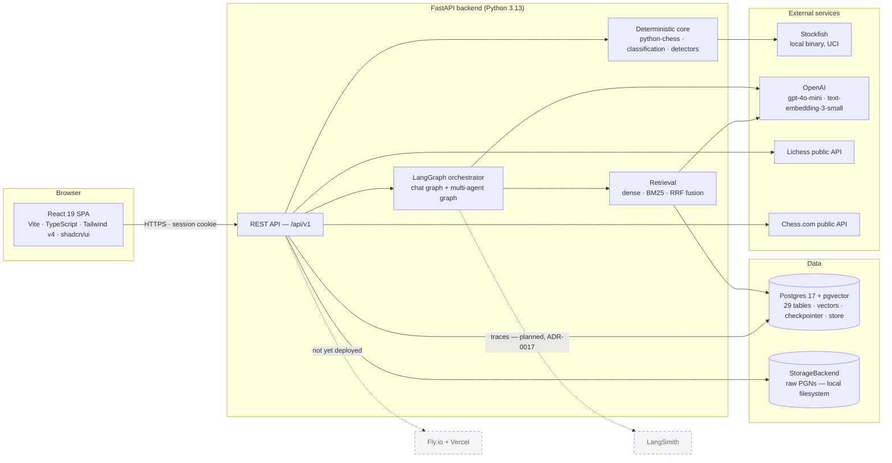

# System infrastructure

Referenced from [`Deliverables.md` §2.2](../Deliverables.md#22-infrastructure-and-stack)
and [`ARCHITECTURE.md` §2](../ARCHITECTURE.md#2-component-architecture).

The stack, one box per piece of infrastructure. Dashed edges are not yet built. The
hosting layer is live — see [`deployment-topology.md`](deployment-topology.md).

## One-sentence justification per choice

| Piece | Why this one |
|---|---|
| **React 19 + Vite + TS** | Typed contracts from API schema to component props, with a build fast enough that the dev loop stays tight. |
| **Tailwind v4 + shadcn/ui** | Shared primitives that theme light and dark from one token set, rather than a component library to fight. |
| **FastAPI** | Async throughout — required, because Stockfish and OpenAI calls are both I/O-bound — with Pydantic validation on every boundary. |
| **LangGraph** | State graph plus a Postgres checkpointer gives durable multi-turn conversation without building persistence ourselves. |
| **python-chess** | The reference implementation for PGN parsing, legality, and FEN/EPD generation; reimplementing it would be inventing bugs. |
| **Stockfish, local** | Free, deterministic at one thread, no per-call cost, and the ground truth every other layer depends on. |
| **Postgres 17 + pgvector** | One engine for relational data *and* vectors, so profile-scoped retrieval joins against application tables inside the same authorization boundary. |
| **OpenAI `gpt-4o-mini`** | Cheap enough to run per chat turn, behind an `LLMProvider` Protocol so the vendor is one adapter away from replaceable. |
| **Lichess / Chess.com public APIs** | Account existence at login and public game archives at import — no OAuth approval gate on either path. |
| **Fly.io + Vercel** *(planned)* | Fly ships the Stockfish binary in a container; Vercel serves a static SPA on a CDN. |
| **LangSmith** *(planned)* | Native LangGraph tracing — the production observability the in-process tracer deliberately does not provide (ADR-0017). |
