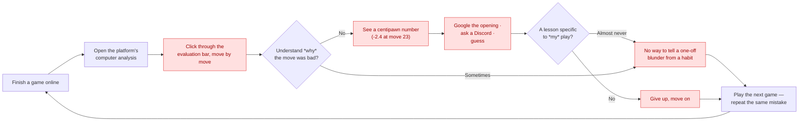

# Current-state workflow and its pain points

Referenced from [`Deliverables.md` §1.3](../Deliverables.md#13-current-state-workflow-and-bottlenecks).

How a club player tries to learn from their games today, without GrandMate. Red nodes are
the points where the loop fails to produce a lesson.

## What the diagram is arguing

The failure is not that engine output is *wrong* — it is exact. The failure is that it is
**per-game and per-move by construction**, so it can never answer the question the player
actually has: *which of my mistakes are habits, and what do I drill?*

The three red nodes in the middle are where the alternatives break down too. Clicking an
evaluation bar is manual pattern-matching the player is least equipped to do about their
own blind spots. Googling produces general advice, not advice about *this* player. And
nothing in the loop retains anything, so the next game starts from zero.

A human coach breaks the loop — but at $30–100/hour, reviewing perhaps one game per
session, that scales to neither thirty games nor a coach's dozen students.
